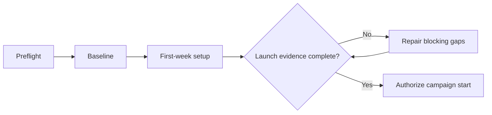

# Operation Renaissance Quickstart

## Purpose

Establish a verified launch state before the 184-day campaign begins.

## Scope

This section covers preflight checks, baseline measurement, and the first seven
days. It does not define the later roadmap, study system, or dashboards.

## Theory

A campaign should begin with known requirements, constraints, risks, and
verification evidence. The quickstart therefore treats readiness as an
engineering gate rather than a feeling.

## Framework

## Implementation

Complete the documents in order:

1. [Preflight Checklist](preflight-checklist.md)
2. [Baseline Assessment](baseline-assessment.md)
3. [First Week Setup](first-week-setup.md)

Store personal observations under `private/`; commit only non-sensitive
configuration and completion evidence.

## Checklist

- [ ] Preflight blockers are resolved or formally accepted.
- [ ] Baseline domains are scored from evidence.
- [ ] Seven orientation days are scheduled.
- [ ] Campaign charter is reviewed.

## Decision Framework

Launch only when repository access, backup, calendar capacity, essential
equipment, and minimum health readiness are confirmed. Defer launch when a
safety issue, unavailable core equipment, or unrealistic capacity would make the
plan non-executable.

## Common Failure Modes

- Treating setup as productive avoidance.
- Recording aspirational rather than observed baseline values.
- Publishing sensitive personal data.
- Starting with unresolved blocking risks.

## Recovery Strategy

Time-box setup repairs to 48 hours. Reduce optional tooling, preserve manual
operation, and record any accepted limitation in the risk register.

## Examples

A missing editor extension is non-blocking if Markdown can still be edited. A
failed backup test is blocking because evidence may be lost.

## References

- [Source register](../../references/source-register.yml)
- `SRC-NASA-SE-2016`

## Cross References

- [Campaign Charter](../01-charter/README.md)
- [Master Architecture](../../MASTER_ARCHITECTURE.md)

## Next Steps

Begin with the [Preflight Checklist](preflight-checklist.md).

## Acceptance Criteria

- [x] Navigation is complete.
- [x] Launch order and gate logic are explicit.
