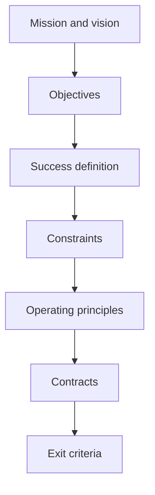

# Operation Renaissance Charter

## Purpose

Define the authority, boundaries, success model, and operating agreements for the
184-day campaign.

## Scope

The charter governs mission and launch decisions. It does not implement the
roadmap or any downstream learning, placement, project, health, finance,
dashboard, or KPI system.

## Theory

Systems engineering begins by clarifying stakeholder needs, objectives,
constraints, interfaces, verification, and decision authority. The charter makes
those commitments inspectable before execution.

## Framework

## Implementation

Read in the displayed order: mission, vision, objectives, success model,
constraints, controllables, principles, philosophy, contracts, and exit criteria.
Resolve contradictions before signing the commitment contract.

## Checklist

- [ ] Mission and vision are understood.
- [ ] Objectives are accepted without outcome guarantees.
- [ ] Constraints and decision rights are recorded.
- [ ] Identity and commitment contracts are signed or declined.
- [ ] Exit criteria are measurable.

## Decision Framework

Authorize the campaign only if its objectives are relevant, its workload is
feasible under observed constraints, and safety and integrity boundaries can be
maintained.

## Common Failure Modes

- Treating the charter as motivational prose.
- Hiding trade-offs behind vague objectives.
- Signing without available capacity.
- Changing success criteria after observing results.

## Recovery Strategy

Open a dated charter amendment, state the evidence requiring change, identify
affected documents, and obtain review before continuing.

## Examples

Reducing project scope after a capacity shock is a controlled amendment. Quietly
removing a failed acceptance criterion is not.

## References

- `SRC-NASA-SE-2016`
- [Source register](../../references/source-register.yml)

## Cross References

- [Quickstart](../00-quickstart/README.md)
- [Master Architecture](../../MASTER_ARCHITECTURE.md)

## Next Steps

Read the [Mission](mission.md).

## Acceptance Criteria

- [x] All charter documents are navigable.
- [x] Governance boundaries are explicit.
