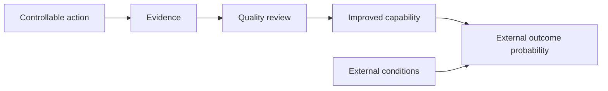

# Controllables vs Outcomes

## Purpose

Separate decisions the operator can execute from results influenced by external
systems.

## Scope

The distinction guides planning and review; it does not imply that outcomes are
irrelevant or that all actions are fully controllable.

## Theory

Engineering manages inputs, processes, interfaces, verification, and risk while
accepting uncertainty in operating environments. Project management similarly
tracks deliverables and risks without assuming stakeholder decisions are
commandable. Focusing reviews on actionable variables improves the chance that a
decision produces a useful change.

## Framework

| Layer | Examples | Review response |
|---|---|---|
| Directly controllable | Attend a planned block, run tests, request feedback, review errors | Execute or repair process |
| Influenceable | Interview performance, mentor response, team coordination | Improve preparation and interface |
| Uncontrollable | Exam difficulty, applicant pool, hiring budget, evaluator preference | Observe, update risk, do not claim control |

## Implementation

Write every goal as an action/evidence pair. Record the desired outcome
separately. During review, change the action, method, scope, or risk response—not
the historical outcome.

## Checklist

- [ ] Every weekly commitment is executable by the operator.
- [ ] Outcome measures are labeled external.
- [ ] Evidence quality is reviewed before volume.
- [ ] No external result is treated as personal or system worth.

## Decision Framework

Ask: “Can a calendar block and acceptance test represent this?” If yes, it is
likely controllable. If another actor or uncertain environment must decide, treat
it as influenceable or uncontrollable.

## Common Failure Modes

- Renaming a hoped-for result as a task.
- Ignoring external feedback because it is uncontrollable.
- Gaming leading measures with low-quality repetitions.
- Assuming effort guarantees selection.

## Recovery Strategy

When an outcome disappoints, perform an evidence review: verify preparation,
identify actionable gaps, record external uncertainty, and choose continue,
change, or stop.

## Examples

“Receive an FPGA role offer” is an outcome. “Publish a tested FPGA project,
complete five role-specific mock interviews, and submit accurate applications”
are controllable actions that may improve its probability.

## References

- `SRC-NASA-SE-2016`
- `SRC-GOLLWITZER-1999`

## Cross References

- [Campaign Objectives](objectives.md)
- [Operating Principles](operating-principles.md)
- [Exit Criteria](exit-criteria.md)

## Next Steps

Adopt the [Operating Principles](operating-principles.md).

## Acceptance Criteria

- [x] Action, influence, and outcome layers are distinct.
- [x] Engineering and project-management analogies are included.
