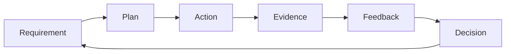

# Execution Philosophy

## Purpose

Define the reasoning model behind Operation Renaissance execution.

## Scope

This document establishes philosophy, not the detailed execution or study
protocols reserved for later sprints.

## Theory

Systems engineering contributes requirements, interfaces, verification, risk,
configuration control, and lifecycle reviews. Deliberate-practice research
supports effortful tasks targeted at improvement with feedback rather than
undirected repetition. Learning research supports retrieval and distributed
practice for durable retention. Behavioral research on implementation intentions
supports linking a specified situation to a planned response. Continuous
improvement contributes short observation–change–verification cycles.

These bodies of work do not imply that one method fits every learner or that
practice alone determines outcomes. The campaign therefore treats methods as
testable operating hypotheses.

## Framework

## Implementation

Define the required capability, choose a representative task, execute under known
conditions, capture evidence, compare it with acceptance criteria, and decide
whether to advance, remediate, change method, or stop.

## Checklist

- [ ] Work begins from a requirement.
- [ ] Practice includes feedback.
- [ ] Learning is reassessed after delay.
- [ ] Process changes are verified.
- [ ] Uncertainty and limits are recorded.

## Decision Framework

Change a method when repeated valid evidence remains below threshold, the method
violates constraints, or a lower-cost alternative produces better verified
results. Do not change solely because work feels difficult.

## Common Failure Modes

- Mistaking repetition for deliberate practice.
- Optimizing short-term fluency instead of delayed retention.
- Changing several variables at once.
- Using behavioral techniques as coercion.

## Recovery Strategy

Return to the smallest representative task, restore feedback, change one variable,
and schedule a delayed reassessment.

## Examples

Re-reading may feel fluent; an unaided explanation reveals retrieval quality. A
failed implementation tested and reviewed produces more decision value than an
untested polished artifact.

## References

- `SRC-NASA-SE-2016`
- `SRC-ERICSSON-1993`
- `SRC-ROEDIGER-KARPICKE-2006`
- `SRC-CEPEDA-2006`
- `SRC-GOLLWITZER-1999`

## Cross References

- [Operating Principles](operating-principles.md)
- [Controllables vs Outcomes](controllables-vs-outcomes.md)

## Next Steps

Review the [Identity Contract](identity-contract.md).

## Acceptance Criteria

- [x] All required disciplines are represented without motivational claims.
