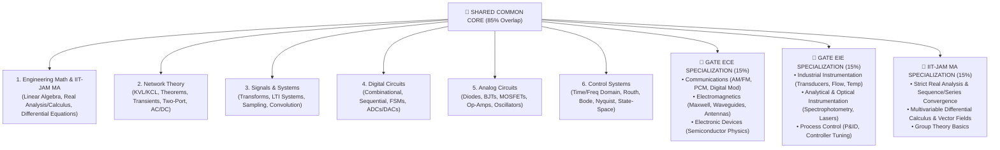

# GATE ECE & EIE + IIT-JAM Mathematics 184-Day Integrated Master Roadmap

> **Campaign:** Operation Renaissance  
> **Target Streams:** GATE ECE (Electronics & Communication), GATE EIE (Instrumentation Engineering), IIT-JAM Mathematics (MA)  
> **Execution Horizon:** 184 Days (Relative Days 1 to 184)  
> **Efficiency Strategy:** 85% Common Core Overlay (Maths, Networks, Signals, Analog/Digital, Control Systems) + 15% Stream-Specific Specialization  

---

## 1. Syllabus Overlap & High-Leverage Core Matrix

By aligning **GATE ECE**, **GATE EIE**, and **IIT-JAM Mathematics**, we achieve a massive synergy where shared topics are studied once and applied across all three targets.



---

## 2. 184-Day Phase Execution Breakdown

| Phase | Relative Days | Primary Focus | Daily Hours Target | Milestone Gate |
|-------|---------------|---------------|-------------------|----------------|
| **Phase 0** | Days 1–7 | Mobilization & Diagnostic Baselines | 6 Hours/Day | Baseline Assessment Completed |
| **Phase 1** | Days 8–49 | Mathematical Foundations & Core Circuits | 8 Hours/Day | Math + Networks + Signals Mastered |
| **Phase 2** | Days 50–98 | Core Electronics & System Dynamics | 8–9 Hours/Day | Analog + Digital + Control Systems Mastered |
| **Phase 3** | Days 99–133 | Specialized Streams (ECE Comm/EMFT vs EIE Sensors) | 9 Hours/Day | Full Syllabus Coverage Completed |
| **Phase 4** | Days 134–168 | PYQs, Full Mock Tests & Error Remediation | 9–10 Hours/Day | 15 Full Mocks Completed (>70 marks) |
| **Phase 5** | Days 169–184 | Final Consolidation & Speed Optimization | 7–8 Hours/Day | Peak Readiness & Formula Revision |

---

## 3. Detailed Daily Target Allocation Schedule

### Phase 0: Mobilization & Diagnostics (Days 1–7)
- **Day 1:** System setup, folder calibration, and baseline exam diagnostic.
- **Days 2–4:** Linear Algebra refresher (Matrices, Determinants, Rank, Eigenvalues).
- **Days 5–7:** Basic circuit laws (KVL/KCL, Independent/Dependent sources).

### Phase 1: Mathematical Foundations & Core Circuits (Days 8–49)
- **Days 8–15 [Math & IIT-JAM MA]:** Real Analysis — Sequences, Series, Tests of Convergence (Ratio, Root, Integral tests).
- **Days 16–23 [Math & IIT-JAM MA]:** Differential Calculus — Mean Value Theorems, Taylor Series, Partial Derivatives, Maxima/Minima.
- **Days 24–31 [Networks - ECE/EIE]:** Network Theorems (Thevenin, Norton, Superposition, Max Power Transfer) + Transient Response (RC, RL).
- **Days 32–39 [Signals & Systems - ECE/EIE]:** Continuous-Time & Discrete-Time LTI systems, Convolution, Fourier Series/Transforms.
- **Days 40–49 [Math & Signals]:** Laplace Transforms, Z-Transforms, Differential Equations (First order & Higher order ODEs).

### Phase 2: Core Electronics & Control Systems (Days 50–98)
- **Days 50–58 [Digital Circuits - ECE/EIE]:** Combinational Logic, K-Maps, Adders, Muxes, Decoders, Code Converters.
- **Days 59–67 [Digital Circuits - ECE/EIE]:** Sequential Logic, Flip-Flops, Registers, Counters, FSMs, ADC/DAC Converters.
- **Days 68–78 [Analog Circuits & EDC - ECE/EIE]:** Diodes, BJT/MOSFET Biasing, Small-Signal Amplifiers, Op-Amp Configurations (Inverting, Non-Inverting, Integrator, Active Filters).
- **Days 79–88 [Control Systems - ECE/EIE]:** Transfer Functions, Block Diagrams, Signal Flow Graphs, Time-Domain Peak Overshoot & Settling Time.
- **Days 89–98 [Control Systems & IIT-JAM Vector Calc]:** Frequency-Domain Stability (Routh-Hurwitz, Root Locus, Bode Plots, Nyquist Plots, State-Space Analysis).

### Phase 3: Stream Specialization (Days 99–133)
- **Days 99–109 [ECE Stream]:** Communications (Analog AM/FM, Pulse PCM/DPCM, Digital BPSK/QPSK/QAM, Noise Figure, Shannon Capacity).
- **Days 99–109 [EIE Stream]:** Industrial Instrumentation (Resistive, Capacitive, Inductive Transducers, Piezoelectric, Thermocouples, RTDs).
- **Days 110–120 [ECE Stream]:** Electromagnetics (Maxwell's Equations, Plane Wave Propagation, Transmission Lines, Smith Chart, Waveguides, Antennas).
- **Days 110–120 [EIE Stream]:** Optical & Analytical Instrumentation (Spectrophotometry, Lasers, Flowmeters, Level Measurement, P&ID Controllers).
- **Days 121–133 [IIT-JAM Specialization]:** Integral Calculus, Surface/Line Integrals (Green's, Stokes', Gauss Divergence Theorems) & Group Theory.

### Phase 4: PYQs & Full-Length Mock Exams (Days 134–168)
- **Daily Target:** 3 Hours PYQ Practice (Last 25 Years GATE ECE/EIE + IIT-JAM) + 3 Hours Error Analysis & Weak Topic Remediation + 3 Hours Full Mock Test (Every alternate day).

### Phase 5: Final Consolidation (Days 169–184)
- **Daily Target:** Short Notes Revision, Formula Card Drills, 1-Hour Speed Tests, and Rest/Recovery to enter exam day at peak cognitive capacity.

---

## 4. Daily Operational Protocol

```
06:00 - 06:30 | Morning Mobility & Calibration
06:30 - 09:30 | SESSION 1: Core Mathematical & Analytical Study (High Cognitive Energy)
09:30 - 10:30 | Breakfast & Break
10:30 - 13:30 | SESSION 2: Core Engineering Subject Study & Derivations
13:30 - 15:00 | Lunch & Rest / Downregulation
15:00 - 17:30 | SESSION 3: Practice Problem Solving & PYQ Drills
17:30 - 18:30 | Physical Exercise / Walk
18:30 - 20:30 | SESSION 4: Revision, Flashcards & Error Log Logging
20:30 - 21:30 | Dinner & Daily Close Review
21:30 - 22:30 | Reading / Soft Prep
22:30         | Lights Out (7.5h Mandatory Sleep)
```

---

## 5. Navigation & Cross-References

- [184-Day Base Roadmap](184-day-roadmap.md)
- [Subject Sequencing](../05-gate-system/subject-sequencing.md)
- [Syllabus Map](../05-gate-system/syllabus-map.md)
- [02 Engineering Foundations](../../02-engineering-foundations/README.md)
- [Knowledge Graph](../../KNOWLEDGE_GRAPH.md)
- [Learning Paths](../../LEARNING_PATHS.md)
