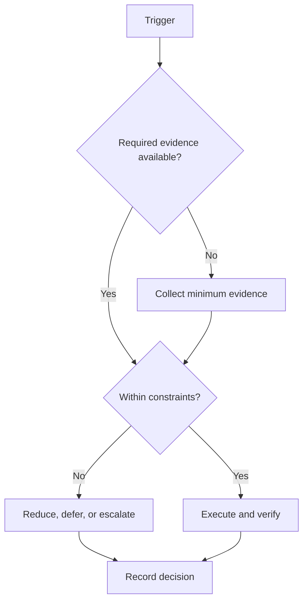

# 184-Day Roadmap

## Purpose

Provide the canonical relative-day phase sequence and adaptation rules.

## Scope

The roadmap covers Day 1 through Day 184. It contains no GATE date or fabricated academic-calendar assumption.

## Theory

A schedule baseline is useful only when configuration, dependencies, risk, assessment, and change control remain connected.

## Framework

| Element | Rule |
|---|---|
| Phase 0 | Days 1–7: Mobilize |
| Phase 1 | Days 8–49: Foundations |
| Phase 2 | Days 50–98: Build |
| Phase 3 | Days 99–133: Integrate |
| Phase 4 | Days 134–168: Demonstrate |
| Phase 5 | Days 169–184: Consolidate |

## Workflow

Set `campaign_start`; calculate each relative day as start plus offset; overlay fixed obligations and exceptions; allocate capacity; run gates at phase boundaries; preserve relative IDs when dates change.

## Decision Tree

When configuration changes, recalculate dates, compare remaining deliverables with capacity, and choose scope reduction before compression.

## Failure Modes

Embedding external exam dates, silently moving evidence gates, and treating all days as equal-capacity production days.

## Recovery

Freeze unsafe work, preserve evidence, rebuild the remaining calendar from actual capacity, and record a schedule-baseline change.

## Examples

If five travel days occur in Phase 2, mark reduced capacity and remove or defer work; do not add five overloaded days later.

## Tables

The framework table is normative. Local values belong in configuration or cycle
records, not this protocol.

## Mermaid Diagrams

The decision tree above defines the control flow for this protocol.

## Cross References

- [Capacity Model](capacity-model.md)
- [Milestones](milestones.md)
- [Daily System](../03-execution-system/daily-system.md)

## References

- `SRC-NASA-SE-2016`
- `SRC-LITTLE-1961`
- `SRC-RUBINSTEIN-2001`
- [Source register](../../references/source-register.yml)

## Next Steps

Verify Phase 0 entry criteria.

## Acceptance Criteria

- [x] Inputs, decisions, evidence, and recovery are explicit.
- [x] No external date or outcome is fabricated.
