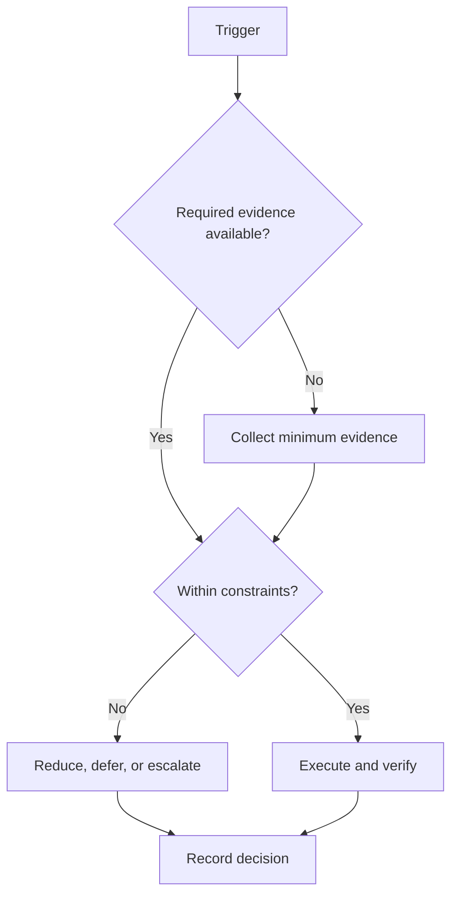

# Operation Renaissance Roadmap

## Purpose

Define navigation and control rules for the configurable 184-day campaign.

## Scope

This section defines phases, milestones, dependencies, and capacity. It does not implement downstream study, project, health, placement, or KPI systems.

## Theory

Lifecycle planning separates objectives into gated phases and integrates technical planning, assessment, risk, and corrective action.

## Framework

| Element | Rule |
|---|---|
| Campaign boundary | Relative Day 1 through Day 184 |
| Configuration | Start date, exclusions, fixed obligations, and capacity bands |
| Gate rule | Evidence authorizes progression; dates only trigger review |
| Canonical sequence | Mobilize → Foundations → Build → Integrate → Demonstrate → Consolidate |

## Workflow

Load configuration; validate 184-day span; review dependencies; allocate capacity; execute phases; conduct milestone gates; archive the final decision.

## Decision Tree

If configuration is incomplete, remain at mobilization. If a gate fails, remediate or reduce scope before advancing.

## Failure Modes

Hard-coded exam dates, automatic phase advancement, duplicated calendars, and plans that consume all available capacity.

## Recovery

Restore configuration, rebaseline remaining relative days, preserve completed evidence, and reissue only affected milestones.

## Examples

A university examination week is recorded as a capacity exception; phase day numbers and gate requirements remain stable.

## Tables

The framework table is normative. Local values belong in configuration or cycle
records, not this protocol.

## Mermaid Diagrams

The decision tree above defines the control flow for this protocol.

## Cross References

- [184-Day Roadmap](184-day-roadmap.md)
- [Integrated GATE ECE/EIE & IIT-JAM Roadmap](184-day-roadmap-integrated-ece-eie-jam.md)
- [Phase 1 — Foundations](phase-1-foundations.md)
- [Phase 2 — Build](phase-2-build.md)
- [Phase 3 — Integrate](phase-3-integrate.md)
- [Phase 4 — Demonstrate](phase-4-demonstrate.md)
- [Phase 5 — Consolidate](phase-5-consolidate.md)
- [Dependency Map](dependency-map.md)
- [Execution System](../03-execution-system/README.md)

## References

- `SRC-NASA-SE-2016`
- `SRC-LITTLE-1961`
- `SRC-RUBINSTEIN-2001`
- [Source register](../../references/source-register.yml)

## Next Steps

Configure the campaign using the 184-day roadmap.

## Acceptance Criteria

- [x] Inputs, decisions, evidence, and recovery are explicit.
- [x] No external date or outcome is fabricated.
