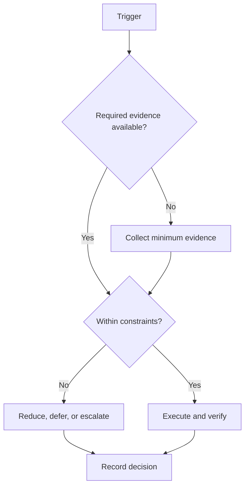

# Capacity Model

## Purpose

Calculate a realistic work envelope before allocating campaign commitments.

## Scope

The model allocates time and attention; it does not prescribe medical thresholds.

## Theory

Capacity is constrained by fixed obligations, recovery, variability, interruptions, and switching overhead. High utilization creates fragile queues, so planned load must remain below observed capacity.

## Framework

| Element | Rule |
|---|---|
| Available hours | Observed discretionary time after fixed obligations |
| Recovery time | Protected sleep opportunity, meals, movement, and decompression |
| Buffer time | At least 15% of discretionary capacity unless evidence supports more |
| Deep-work capacity | Observed high-attention blocks, not total free time |
| Switching cost | Transition allowance between different work types |
| Interruptions | Expected disruption reserve from recent observations |
| Fatigue | Private readiness signal that can reduce planned load |
| Overload threshold | Two consecutive periods above capacity or guardrail breach |
| Recovery threshold | Stable guardrails and completed minimum load before ramp-up |

## Workflow

Audit seven representative days; subtract fixed and recovery commitments; estimate switching and interruptions; reserve buffer; allocate the remainder; compare planned and observed capacity weekly.

## Decision Tree

If planned load exceeds usable capacity, reduce scope. If overload triggers, shift to minimum viable continuity and do not ramp until the recovery threshold is met.

## Failure Modes

Equating free time with deep-work time, planning at 100% utilization, and paying for missed work with recovery time.

## Recovery

Stop schedule compression, protect recovery, cut WIP, rebaseline from observed capacity, and increase load gradually after stability.

## Examples

Twenty nominal free hours may yield twelve usable hours after buffer, transitions, and interruptions; the plan uses twelve.

## Tables

The framework table is normative. Local values belong in configuration or cycle
records, not this protocol.

## Mermaid Diagrams

The decision tree above defines the control flow for this protocol.

## Cross References

- [Weekly System](../03-execution-system/weekly-system.md)
- [WIP Limits](../03-execution-system/work-in-progress-limits.md)
- [Interruption Protocol](../03-execution-system/interruption-protocol.md)

## References

- `SRC-NASA-SE-2016`
- `SRC-LITTLE-1961`
- `SRC-RUBINSTEIN-2001`
- [Source register](../../references/source-register.yml)

## Next Steps

Use calculated capacity when constructing the first weekly plan.

## Acceptance Criteria

- [x] Inputs, decisions, evidence, and recovery are explicit.
- [x] No external date or outcome is fabricated.
