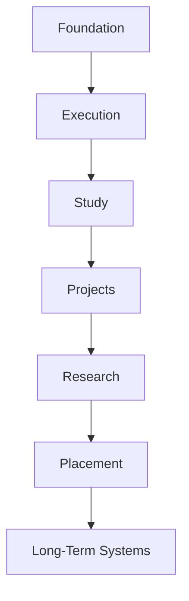
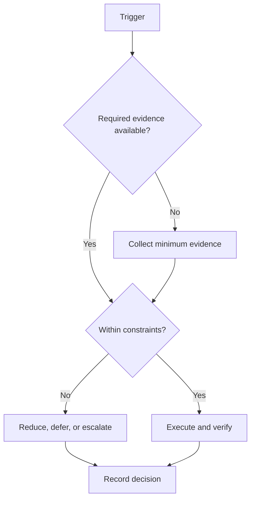

# Campaign Dependency Map

## Purpose

Represent prerequisite order and downstream interfaces.

## Scope

This map identifies dependencies without implementing downstream systems.

## Theory

Dependency control prevents later work from claiming readiness when prerequisite evidence is absent. Links are directional; related work is not automatically a dependency.

## Framework

| Element | Rule |
|---|---|
| Foundation | Charter, baseline, constraints |
| Execution | Roadmap, capacity, daily/weekly/monthly control |
| Study | Future learning protocols |
| Projects | Future verified artifact lifecycle |
| Research | Future evidence and experiment practice |
| Placement | Future role-linked readiness |
| Long-term systems | Future post-campaign modules |

## Workflow

Verify the upstream node; record its evidence ID; authorize the downstream interface; block or remediate any unresolved mandatory dependency.

## Decision Tree

When a dependency is absent, do not bypass it. Determine whether it is mandatory, replaceable, or incorrectly modeled, then record the decision.

## Failure Modes

Treating a related document as prerequisite, allowing circular dependencies, and declaring readiness from file presence alone.

## Recovery

Return to the earliest invalid dependency, restore evidence, and regenerate the downstream readiness decision.

## Examples

Project work may begin only after relevant execution and study prerequisites exist; the directory’s presence is not evidence.

## Tables

The framework table is normative. Local values belong in configuration or cycle
records, not this protocol.

## Mermaid Diagrams

The decision tree above defines the control flow for this protocol.

## Cross References

- [Foundation](../01-charter/README.md)
- [Execution System](../03-execution-system/README.md)
- [Milestones](milestones.md)

## References

- `SRC-NASA-SE-2016`
- `SRC-LITTLE-1961`
- `SRC-RUBINSTEIN-2001`
- [Source register](../../references/source-register.yml)

## Next Steps

Use this map during every phase-entry review.

## Acceptance Criteria

- [x] Inputs, decisions, evidence, and recovery are explicit.
- [x] No external date or outcome is fabricated.
