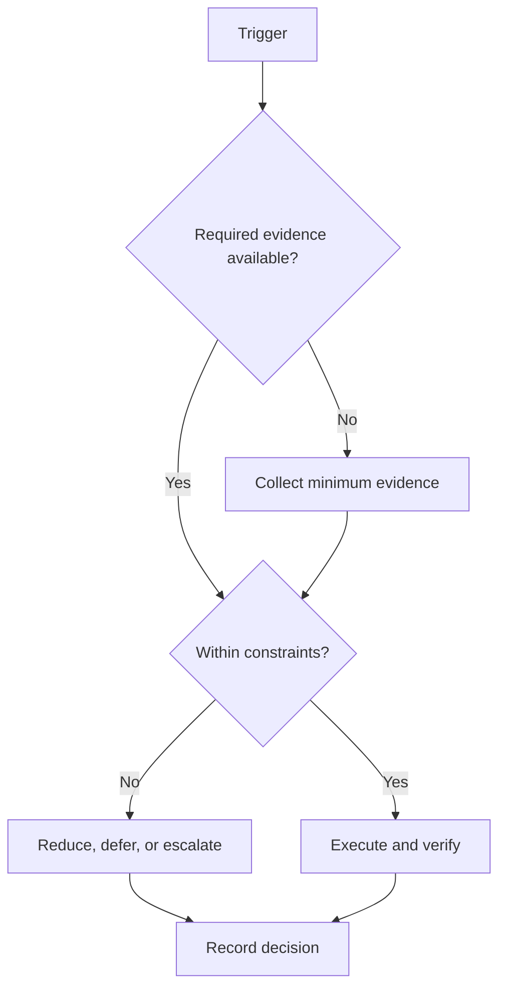

# Milestone Gates

## Purpose

Define evidence packages required at campaign decision points.

## Scope

Milestones verify readiness and progress; detailed domain rubrics remain future work.

## Theory

A milestone is a control gate, not a celebration date. Verification requires traceable evidence, reviewer status, unresolved risks, and an explicit disposition.

## Framework

| Element | Rule |
|---|---|
| Knowledge evidence | Assessment plus error review |
| Project evidence | Requirements, tests, artifact, and review status |
| Health evidence | Private guardrail status only; no sensitive detail |
| Execution evidence | Plans, closures, and exception decisions |
| Portfolio evidence | Reproducible, accurately described release |
| Review evidence | Signed gate record and open actions |

## Workflow

Assemble the evidence index; validate sources and freshness; classify each required item as met, partial, unmet, or not assessable; review risk; issue advance, remediate, accept-risk, or stop.

## Decision Tree

A partial mandatory item blocks advancement unless the charter permits documented risk acceptance; safety and integrity failures cannot be accepted for schedule reasons.

## Failure Modes

Counting activity as evidence, reviewing stale artifacts, and changing gate criteria after results are known.

## Recovery

Correct the evidence index, restore original criteria, close critical defects, and repeat only the failed gate elements.

## Examples

A project screenshot without source, tests, and reproduction steps does not satisfy project or portfolio evidence.

## Tables

The framework table is normative. Local values belong in configuration or cycle
records, not this protocol.

## Mermaid Diagrams

The decision tree above defines the control flow for this protocol.

## Cross References

- [Phase 0](phase-0-mobilize.md)
- [Exit Criteria](../01-charter/exit-criteria.md)
- [Dependency Map](dependency-map.md)

## References

- `SRC-NASA-SE-2016`
- `SRC-LITTLE-1961`
- `SRC-RUBINSTEIN-2001`
- [Source register](../../references/source-register.yml)

## Next Steps

Attach milestone gates to the six phase boundaries.

## Acceptance Criteria

- [x] Inputs, decisions, evidence, and recovery are explicit.
- [x] No external date or outcome is fabricated.
