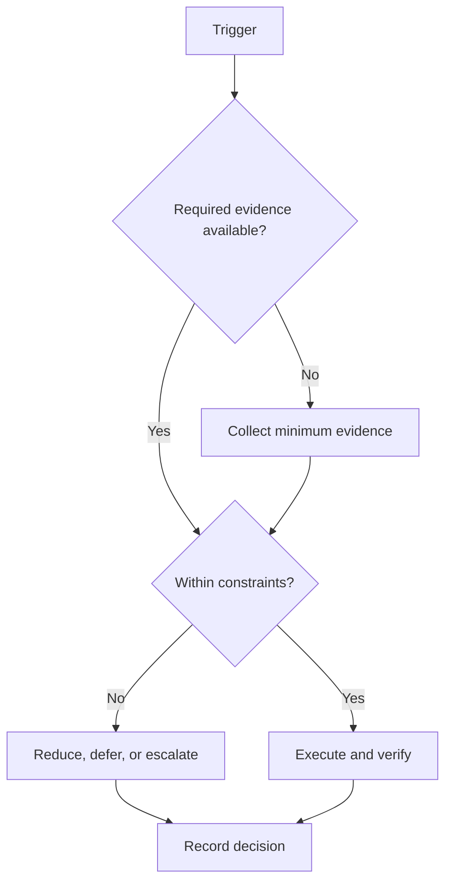

# Phase 1: Foundations

## Purpose

Stabilize execution and repair priority prerequisite gaps.

## Scope

This phase governs campaign Days 8–49. Calendar dates are generated from configuration.

## Theory

A lifecycle phase isolates a coherent objective and ends with evidence-based review. Calendar passage does not satisfy a gate.

## Framework

| Element | Rule |
|---|---|
| Relative days | Days 8–49 |
| Expected outcomes | Repeatable weekly operation and reassessed foundational capability |
| Deliverables | weekly evidence sets; prerequisite assessments; first bounded artifact specification |
| KPIs | Evidence completeness, gate status, capacity adherence, open risk count |
| Entry criteria | Phase 0 gate passed and first weekly capacity plan approved |
| Exit criteria | stable review cadence; mandatory prerequisite evidence accepted |
| Risks | over-broad subject load, shallow repetition, early project scope growth |
| Dependencies | Phase 0 evidence and future Study System |

## Workflow

Confirm entry evidence; allocate capacity; execute only phase deliverables; review risks weekly; assemble the exit package; conduct the gate; record advance, remediate, or stop.

## Decision Tree

Advance only when mandatory exit evidence is verified. A date boundary triggers review, not automatic promotion.

## Failure Modes

hours counted as mastery, skipped reviews, and backlog accumulation

## Recovery

reduce parallel subjects, restore feedback, remediate the blocking prerequisite

## Examples

Example: weekly evidence sets is accepted only when its evidence link and reviewer are recorded.

## Tables

The framework table is normative. Local values belong in configuration or cycle
records, not this protocol.

## Mermaid Diagrams

The decision tree above defines the control flow for this protocol.

## Cross References

- [184-Day Roadmap](184-day-roadmap.md)
- [Milestones](milestones.md)
- [Capacity Model](capacity-model.md)

## References

- `SRC-NASA-SE-2016`
- `SRC-LITTLE-1961`
- `SRC-RUBINSTEIN-2001`
- [Source register](../../references/source-register.yml)

## Next Steps

Proceed to Phase 2: Build only after the gate decision.

## Acceptance Criteria

- [x] Inputs, decisions, evidence, and recovery are explicit.
- [x] No external date or outcome is fabricated.
