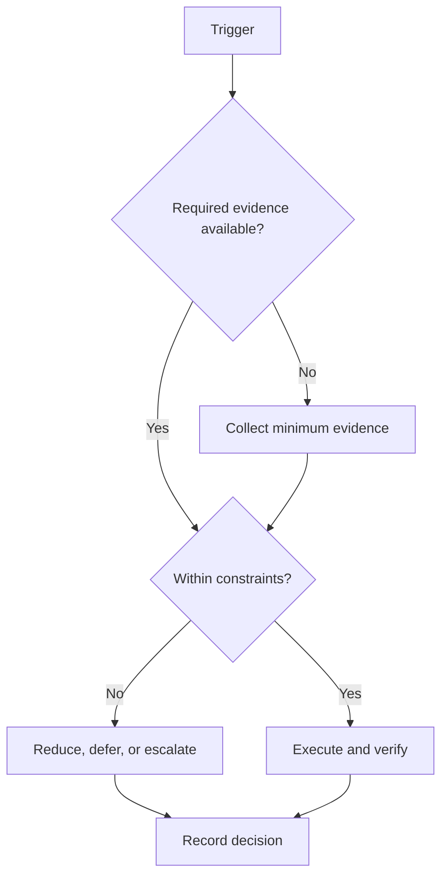

# Phase 4: Demonstrate

## Purpose

Produce externally legible, accurately bounded evidence.

## Scope

This phase governs campaign Days 134–168. Calendar dates are generated from configuration.

## Theory

A lifecycle phase isolates a coherent objective and ends with evidence-based review. Calendar passage does not satisfy a gate.

## Framework

| Element | Rule |
|---|---|
| Relative days | Days 134–168 |
| Expected outcomes | Reviewed portfolio, assessment, and professional communication artifacts |
| Deliverables | portfolio release; mock performance review; reviewed presentation and resume evidence |
| KPIs | Evidence completeness, gate status, capacity adherence, open risk count |
| Entry criteria | Phase 3 gate passed and integrated artifacts reproducible |
| Exit criteria | claims match evidence; release checks pass; unresolved limitations disclosed |
| Risks | polish displacing verification, audience mismatch, and outcome fixation |
| Dependencies | Integrated evidence and approved placement/communication systems |

## Workflow

Confirm entry evidence; allocate capacity; execute only phase deliverables; review risks weekly; assemble the exit package; conduct the gate; record advance, remediate, or stop.

## Decision Tree

Advance only when mandatory exit evidence is verified. A date boundary triggers review, not automatic promotion.

## Failure Modes

inflated claims, unreproducible demos, and excessive application volume

## Recovery

correct claims, restore tests, narrow audience, and repeat the review

## Examples

Example: portfolio release is accepted only when its evidence link and reviewer are recorded.

## Tables

The framework table is normative. Local values belong in configuration or cycle
records, not this protocol.

## Mermaid Diagrams

The decision tree above defines the control flow for this protocol.

## Cross References

- [184-Day Roadmap](184-day-roadmap.md)
- [Milestones](milestones.md)
- [Capacity Model](capacity-model.md)

## References

- `SRC-NASA-SE-2016`
- `SRC-LITTLE-1961`
- `SRC-RUBINSTEIN-2001`
- [Source register](../../references/source-register.yml)

## Next Steps

Proceed to Phase 5: Consolidate only after the gate decision.

## Acceptance Criteria

- [x] Inputs, decisions, evidence, and recovery are explicit.
- [x] No external date or outcome is fabricated.
