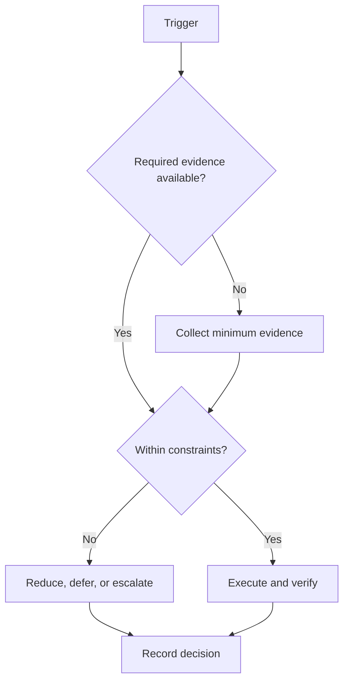

# Phase 5: Consolidate

## Purpose

Close evidence, disclose gaps, and decide the next operating cycle.

## Scope

This phase governs campaign Days 169–184. Calendar dates are generated from configuration.

## Theory

A lifecycle phase isolates a coherent objective and ends with evidence-based review. Calendar passage does not satisfy a gate.

## Framework

| Element | Rule |
|---|---|
| Relative days | Days 169–184 |
| Expected outcomes | Auditable campaign record and evidence-based transition decision |
| Deliverables | final evidence index; exit-criteria review; archive; next-cycle decision |
| KPIs | Evidence completeness, gate status, capacity adherence, open risk count |
| Entry criteria | Phase 4 gate passed and final-review inputs complete |
| Exit criteria | mandatory exit criteria dispositioned; records preserved; next decision approved |
| Risks | last-minute scope, historical rewriting, and incomplete handoff |
| Dependencies | All prior phase gates and charter exit criteria |

## Workflow

Confirm entry evidence; allocate capacity; execute only phase deliverables; review risks weekly; assemble the exit package; conduct the gate; record advance, remediate, or stop.

## Decision Tree

Advance only when mandatory exit evidence is verified. A date boundary triggers review, not automatic promotion.

## Failure Modes

cramming new work, hiding unmet criteria, and treating Day 184 as automatic success

## Recovery

freeze scope, preserve original evidence, classify incomplete criteria honestly

## Examples

Example: final evidence index is accepted only when its evidence link and reviewer are recorded.

## Tables

The framework table is normative. Local values belong in configuration or cycle
records, not this protocol.

## Mermaid Diagrams

The decision tree above defines the control flow for this protocol.

## Cross References

- [184-Day Roadmap](184-day-roadmap.md)
- [Milestones](milestones.md)
- [Capacity Model](capacity-model.md)

## References

- `SRC-NASA-SE-2016`
- `SRC-LITTLE-1961`
- `SRC-RUBINSTEIN-2001`
- [Source register](../../references/source-register.yml)

## Next Steps

Close the campaign through the final evidence and decision record.

## Acceptance Criteria

- [x] Inputs, decisions, evidence, and recovery are explicit.
- [x] No external date or outcome is fabricated.
