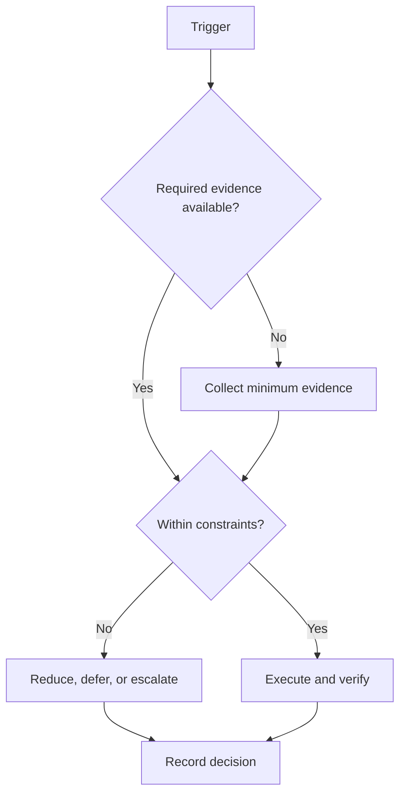

# Execution System

## Purpose

Define navigation and interfaces for daily, weekly, monthly, semester, and exception control.

## Scope

This section governs execution mechanics only; downstream domain systems remain outside scope.

## Theory

An execution engine connects plans to evidence and evidence to decisions at nested cadences.

## Framework

| Element | Rule |
|---|---|
| Daily | Execute, capture evidence, close |
| Weekly | Allocate capacity and review risk |
| Monthly | Review capability and system performance |
| Exception | Interrupt, recover, rebaseline |

## Workflow

Start with capacity; build the weekly plan; derive daily blocks; close each day; run weekly and monthly reviews; invoke interruption and recovery rules when conditions change.

## Decision Tree

Choose the shortest cadence capable of correcting the defect; escalate persistent or unsafe conditions.

## Failure Modes

Independent trackers, automatic carryover, and using future system placeholders as instructions.

## Recovery

Return to the canonical plan, reconcile evidence, and restart from the next review boundary.

## Examples

A missed block is handled in the daily close; a changed semester workload requires weekly or monthly rebaseline.

## Tables

The framework table is normative. Local values belong in configuration or cycle
records, not this protocol.

## Mermaid Diagrams

The decision tree above defines the control flow for this protocol.

## Cross References

- [Roadmap](../02-roadmap/README.md)
- [Daily System](daily-system.md)
- [Weekly System](weekly-system.md)

## References

- `SRC-NASA-SE-2016`
- `SRC-LITTLE-1961`
- `SRC-RUBINSTEIN-2001`
- [Source register](../../references/source-register.yml)

## Next Steps

Build the first weekly plan from the capacity model.

## Acceptance Criteria

- [x] Inputs, decisions, evidence, and recovery are explicit.
- [x] No external date or outcome is fabricated.
