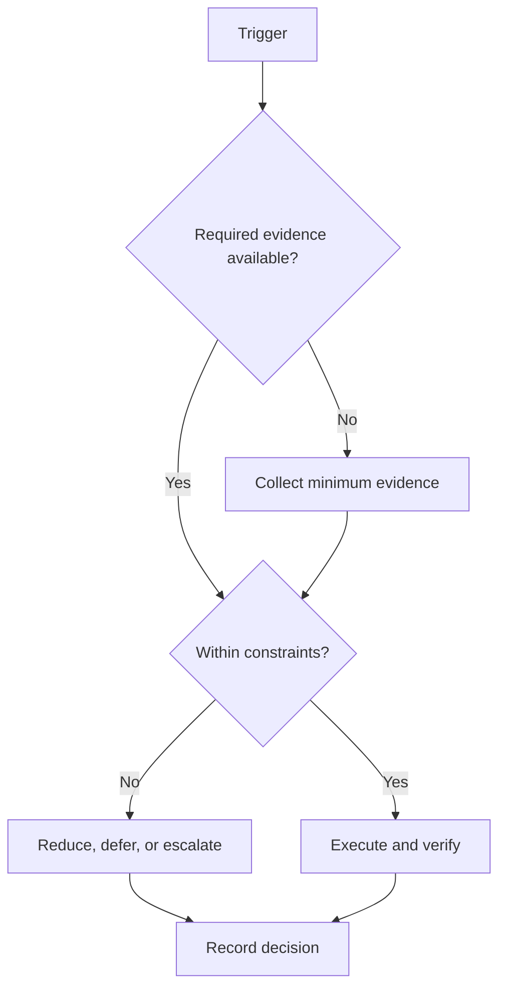

# Daily System

## Purpose

Convert weekly outcomes into a safe, evidence-producing day.

## Scope

The protocol covers startup through shutdown; detailed learning or health prescriptions are excluded.

## Theory

A day is a bounded control cycle. Planning uses known capacity, execution limits switching, and closure prevents hidden carryover.

## Framework

| Element | Rule |
|---|---|
| Morning startup | Check readiness, calendar, and blocking changes |
| Planning | One primary and at most two secondary deliverables |
| Deep-work blocks | High-attention work with explicit acceptance evidence |
| Study blocks | Only under the future approved study protocol |
| Admin window | Batch messages and low-attention work |
| Exercise window | Reserve configured activity time; no clinical prescription |
| Reflection window | Record observation, not self-judgment |
| Shutdown | Log evidence, prepare tomorrow, reset workspace |

## Workflow

Startup; select deliverables; timebox blocks; execute; use breaks and admin window; record evidence; close incomplete work with delete, reduce, reschedule, or escalate; shut down.

## Decision Tree

If readiness is below the configured threshold, switch to reduced-load or recovery mode. Never borrow from protected recovery.

## Failure Modes

Overscheduling, checking messages between every block, carrying all unfinished work forward, and confusing hours with evidence.

## Recovery

Keep one minimum continuity action, close the primary blocker, reduce tomorrow’s load, and escalate persistent fatigue or safety concerns.

## Examples

If a two-hour design block yields a verified interface but not the whole module, close the evidence and rescope the next action.

## Tables

The framework table is normative. Local values belong in configuration or cycle
records, not this protocol.

## Mermaid Diagrams

The decision tree above defines the control flow for this protocol.

## Cross References

- [Weekly System](weekly-system.md)
- [Timeboxing](timeboxing-protocol.md)
- [Shutdown](shutdown-protocol.md)

## References

- `SRC-NASA-SE-2016`
- `SRC-LITTLE-1961`
- `SRC-RUBINSTEIN-2001`
- [Source register](../../references/source-register.yml)

## Next Steps

Execute the day and complete the shutdown record.

## Acceptance Criteria

- [x] Inputs, decisions, evidence, and recovery are explicit.
- [x] No external date or outcome is fabricated.
