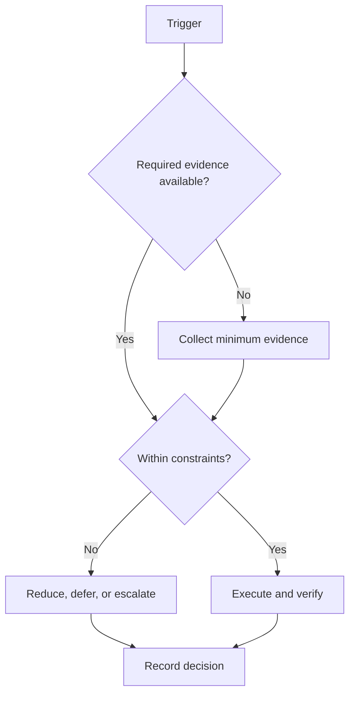

# Interruption Protocol

## Purpose

Classify disruptions and preserve safety, evidence, and restartability.

## Scope

This protocol routes events; it does not provide medical, emergency, or family advice.

## Theory

Interruptions differ in urgency, duration, and control. A standard triage reduces impulsive rescheduling and protects context for recovery.

## Framework

| Element | Rule |
|---|---|
| Unexpected assignment | Verify deadline; displace lower-priority work |
| Illness | Stop unsafe load; follow appropriate care and private recovery plan |
| Family event | Protect required presence; declare capacity exception |
| Lost study day | Close the day; do not compress backlog |
| Travel | Predeclare reduced mode and offline work |
| Mental fatigue | Reduce cognitive load; use recovery/escalation boundary |
| Laptop failure | Use backup device/manual mode; restore from verified backup |
| Internet failure | Switch to offline queue; defer network-only tasks |

## Workflow

Make the situation safe; classify duration and urgency; save state and restart cue; notify affected parties where appropriate; choose continue, reduced mode, pause, or stop; rebaseline at the next review.

## Decision Tree

Safety emergencies override the workflow. For other events, preserve fixed obligations and recovery, then reduce campaign scope.

## Failure Modes

Pretending disruption did not occur, rescheduling every missed task, exposing private details, and using recovery time as catch-up.

## Recovery

Activate minimum viable continuity only if safe, preserve evidence, close stale commitments, and ramp after capacity is re-established.

## Examples

During internet loss, continue an offline problem set and record blocked downloads; do not repeatedly poll the connection.

## Tables

The framework table is normative. Local values belong in configuration or cycle
records, not this protocol.

## Mermaid Diagrams

The decision tree above defines the control flow for this protocol.

## Cross References

- [Daily System](daily-system.md)
- [Capacity Model](../02-roadmap/capacity-model.md)
- [Semester Integration](semester-integration.md)

## References

- `SRC-NASA-SE-2016`
- `SRC-LITTLE-1961`
- `SRC-RUBINSTEIN-2001`
- [Source register](../../references/source-register.yml)

## Next Steps

Add event-specific contacts and offline assets to private configuration.

## Acceptance Criteria

- [x] Inputs, decisions, evidence, and recovery are explicit.
- [x] No external date or outcome is fabricated.
