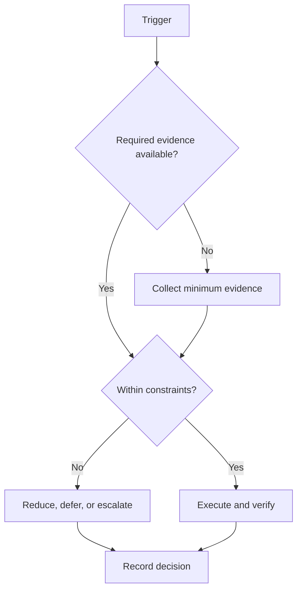

# Monthly System

## Purpose

Review capability, projects, learning, capacity, finance awareness, risk, and system changes at a strategic cadence.

## Scope

The review consumes evidence from authorized systems; it does not implement health, finance, project, or learning content.

## Theory

Monthly review detects structural drift that daily or weekly correction may miss and limits process changes to testable improvements.

## Framework

| Element | Rule |
|---|---|
| Capability | Compare reassessment evidence with prior baseline |
| Project | Review gate status and verification debt |
| Learning | Review delayed assessment and recurring errors |
| Health | Review private guardrail status only |
| Financial | Review awareness and campaign resource constraints only |
| Risk | Reassess likelihood, consequence, triggers, and responses |
| System improvement | Select at most one process experiment |

## Workflow

Freeze the period; assemble evidence; review each domain at its canonical source; inspect capacity trend; close or escalate risks; choose one system improvement; approve next-month constraints and objectives.

## Decision Tree

If evidence coverage is insufficient, do not infer progress. Repair observability before optimizing the process.

## Failure Modes

Changing many processes, duplicating domain data, interpreting private guardrails clinically, and hiding incomplete evidence.

## Recovery

Restore canonical evidence, reverse unsupported changes, reduce next-month scope, and schedule a focused reassessment.

## Examples

If review shows repeated switching loss, test a single change: group one category of work into fixed windows next month.

## Tables

The framework table is normative. Local values belong in configuration or cycle
records, not this protocol.

## Mermaid Diagrams

The decision tree above defines the control flow for this protocol.

## Cross References

- [Weekly System](weekly-system.md)
- [Milestones](../02-roadmap/milestones.md)
- [Semester Integration](semester-integration.md)

## References

- `SRC-NASA-SE-2016`
- `SRC-LITTLE-1961`
- `SRC-RUBINSTEIN-2001`
- [Source register](../../references/source-register.yml)

## Next Steps

Approve the next month’s constraints and one improvement experiment.

## Acceptance Criteria

- [x] Inputs, decisions, evidence, and recovery are explicit.
- [x] No external date or outcome is fabricated.
