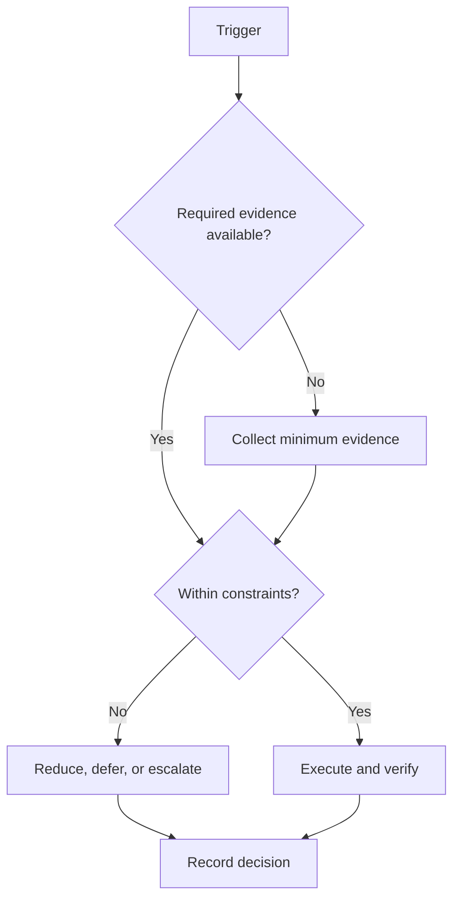

# Prioritization Protocol

## Purpose

Select work using transparent evidence rather than urgency alone.

## Scope

The framework ranks eligible work after hard constraints and WIP limits are applied.

## Theory

Priority is a decision about sequence and capacity. Dependency leverage and recovery cost can dominate visible urgency.

## Framework

| Element | Rule |
|---|---|
| Urgency | Consequence of delay inside a verified time window |
| Importance | Traceability to charter objective or hard obligation |
| Impact | Expected evidence or risk reduction |
| Dependencies | Number and criticality of downstream items unblocked |
| Recovery cost | Cost of interruption, restart, or missed guardrail |
| Evidence confidence | Quality of information supporting the score |

## Workflow

Remove unsafe or unauthorized work; check dependencies; score each factor 0–4 with evidence; record uncertainty; select within WIP and capacity; name displaced work; review when conditions change.

## Decision Tree

A hard safety or institutional constraint overrides score. Otherwise prioritize highest dependency-adjusted value, breaking ties with lower recovery cost and stronger evidence.

## Failure Modes

False precision, marking every item urgent, ignoring restart cost, and scoring work already outside constraints.

## Recovery

Discard unsupported scores, compare the top two alternatives directly, run a reversible probe if uncertainty is high, and record the decision.

## Examples

A prerequisite assessment may outrank a portfolio polish task because it unblocks several future activities.

## Tables

The framework table is normative. Local values belong in configuration or cycle
records, not this protocol.

## Mermaid Diagrams

The decision tree above defines the control flow for this protocol.

## Cross References

- [WIP Limits](work-in-progress-limits.md)
- [Constraints](../01-charter/constraints.md)
- [Weekly System](weekly-system.md)

## References

- `SRC-NASA-SE-2016`
- `SRC-LITTLE-1961`
- `SRC-RUBINSTEIN-2001`
- [Source register](../../references/source-register.yml)

## Next Steps

Prioritize the next weekly candidate list.

## Acceptance Criteria

- [x] Inputs, decisions, evidence, and recovery are explicit.
- [x] No external date or outcome is fabricated.
