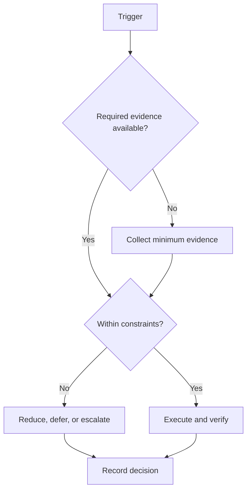

# Semester Integration

## Purpose

Integrate college obligations with campaign work under realistic capacity.

## Scope

The protocol coordinates assignments, labs, projects, future GATE and placement work, and recovery without fabricating a timetable.

## Theory

Institutional deadlines are fixed interfaces. Campaign scope must adapt to them, and overlapping evidence should be reused only when standards align.

## Framework

| Element | Rule |
|---|---|
| College | Fixed classes, examinations, and institutional rules |
| Assignments | Deadline-driven work with academic-integrity constraints |
| Labs | Preparation, attendance, analysis, and submission |
| Projects | Prefer shared evidence only with explicit permission and requirements |
| GATE | Future system receives remaining capacity |
| Placement | Future system uses role-specific bounded windows |
| Health | Protected recovery constraints override compression |

## Workflow

Import verified academic dates; classify fixed and flexible commitments; map legitimate overlap; calculate remaining capacity; allocate campaign work; reserve peak-week reductions; review weekly.

## Decision Tree

When institutional load rises, protect mandatory academic and recovery constraints, then reduce campaign scope in dependency order.

## Failure Modes

Assuming every week is normal, double-counting one artifact, violating collaboration rules, and using nights to absorb deadline collisions.

## Recovery

Declare a peak-load mode, freeze optional campaign work, preserve minimum continuity, and rebaseline after the institutional deadline.

## Examples

A course HDL project may support portfolio evidence only if reuse is permitted and its claims, tests, and authorship are clear.

## Tables

The framework table is normative. Local values belong in configuration or cycle
records, not this protocol.

## Mermaid Diagrams

The decision tree above defines the control flow for this protocol.

## Cross References

- [Capacity Model](../02-roadmap/capacity-model.md)
- [Weekly System](weekly-system.md)
- [Interruption Protocol](interruption-protocol.md)

## References

- `SRC-NASA-SE-2016`
- `SRC-LITTLE-1961`
- `SRC-RUBINSTEIN-2001`
- [Source register](../../references/source-register.yml)

## Next Steps

Enter the actual semester constraints into the next weekly capacity review.

## Acceptance Criteria

- [x] Inputs, decisions, evidence, and recovery are explicit.
- [x] No external date or outcome is fabricated.
