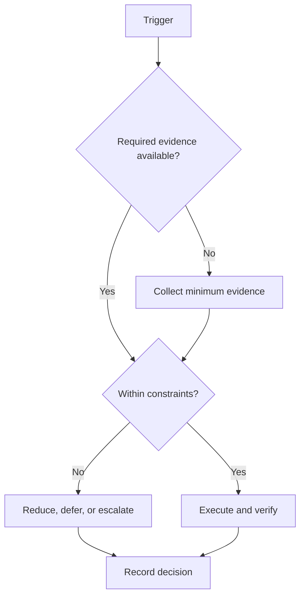

# Shutdown Protocol

## Purpose

Close the workday with complete evidence and a low-friction restart state.

## Scope

The protocol takes approximately ten minutes and does not perform the weekly review.

## Theory

Closure reduces hidden work, captures context before forgetting, and creates an explicit boundary between execution and recovery.

## Framework

| Element | Rule |
|---|---|
| Evidence logged | Link completed artifacts and test results |
| Incomplete work | Delete, reduce, reschedule, or escalate |
| Tomorrow prepared | Write the first executable action and required materials |
| Workspace reset | Save, back up, close tools, clear hazards |
| Reflection | Record one observation and one decision |
| Recovery | End work at the configured boundary |

## Workflow

Stop new work; collect evidence; disposition incomplete items; record blockers; prepare the first next action; verify backup; reset workspace; state shutdown complete.

## Decision Tree

If evidence is not saved, preserve it before shutdown. If closure would exceed ten minutes, create one administrative action for the next window.

## Failure Modes

Starting another task, writing a long diary, carrying everything forward, and leaving unsaved or untested work open.

## Recovery

Perform an emergency save, record a restart cue, close the environment, and repair missing detail in the next admin window.

## Examples

“Open test report and reproduce failure 12” is a restart cue; “continue project” is not.

## Tables

The framework table is normative. Local values belong in configuration or cycle
records, not this protocol.

## Mermaid Diagrams

The decision tree above defines the control flow for this protocol.

## Cross References

- [Daily System](daily-system.md)
- [Weekly System](weekly-system.md)
- [Timeboxing](timeboxing-protocol.md)

## References

- `SRC-NASA-SE-2016`
- `SRC-LITTLE-1961`
- `SRC-RUBINSTEIN-2001`
- [Source register](../../references/source-register.yml)

## Next Steps

End the day and protect the configured recovery boundary.

## Acceptance Criteria

- [x] Inputs, decisions, evidence, and recovery are explicit.
- [x] No external date or outcome is fabricated.
