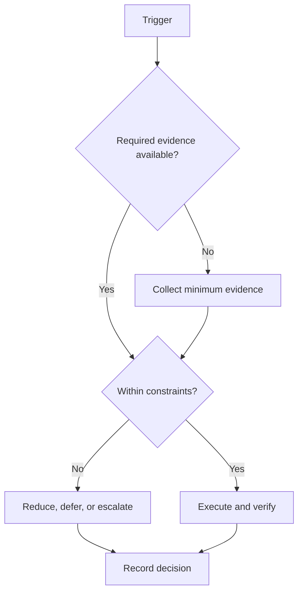

# Timeboxing Protocol

## Purpose

Bound work periods by purpose, acceptance evidence, and recovery rules.

## Scope

Block lengths are configurable; this protocol does not prescribe a universal attention interval.

## Theory

Timeboxes constrain scope and expose estimates. Switching between rulesets can add measurable overhead, so related work is grouped where practical.

## Framework

| Element | Rule |
|---|---|
| Block length | Choose from observed focus capacity and task risk |
| Focus rule | One task, one evidence target, unrelated tools closed |
| Break rule | Leave the task and perform configured recovery |
| Switching | Add transition time and capture restart context |
| Interruption | Record, classify, and route through interruption protocol |
| Recovery | Stop when quality or safety threshold is breached |

## Workflow

Define outcome and evidence; select a bounded block; remove foreseeable interruptions; execute; stop at boundary; record evidence and next restart cue; take the configured break; decide repeat, change, or close.

## Decision Tree

Extend a block only when it remains safe, no fixed obligation is displaced, and a short extension closes a verifiable unit.

## Failure Modes

Using timers without acceptance criteria, endlessly extending blocks, skipping breaks, and switching tasks inside a block.

## Recovery

End the block, save state, record the interruption or fatigue trigger, recover, and resume only with a new explicit timebox.

## Examples

A 50-minute debugging block targets reproduction and root-cause evidence, not “finish debugging.”

## Tables

The framework table is normative. Local values belong in configuration or cycle
records, not this protocol.

## Mermaid Diagrams

The decision tree above defines the control flow for this protocol.

## Cross References

- [Daily System](daily-system.md)
- [Interruption Protocol](interruption-protocol.md)
- [Shutdown](shutdown-protocol.md)

## References

- `SRC-NASA-SE-2016`
- `SRC-LITTLE-1961`
- `SRC-RUBINSTEIN-2001`
- [Source register](../../references/source-register.yml)

## Next Steps

Calibrate block lengths from the next five observed sessions.

## Acceptance Criteria

- [x] Inputs, decisions, evidence, and recovery are explicit.
- [x] No external date or outcome is fabricated.
