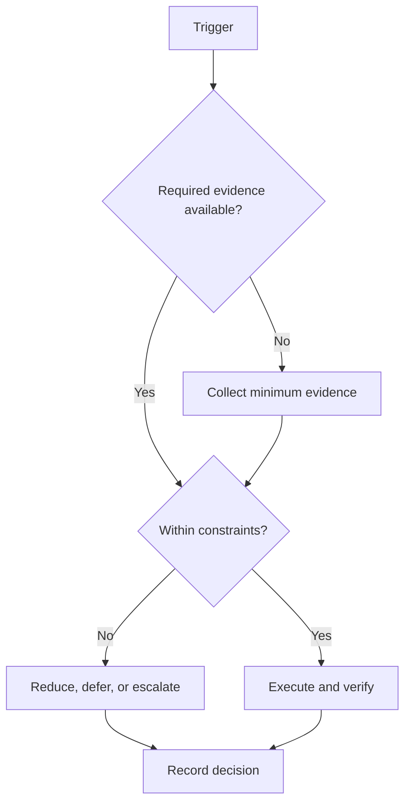

# Weekly System

## Purpose

Allocate capacity to no more than three outcomes and close the weekly feedback loop.

## Scope

The week coordinates commitments and risk; domain curricula remain external inputs.

## Theory

Weekly cadence is long enough to produce evidence and short enough to correct overload or drift.

## Framework

| Element | Rule |
|---|---|
| Planning | Review prior evidence and choose ≤3 outcomes |
| Execution | Derive daily blocks and protect 15% or more buffer |
| Review | Compare planned, completed, and accepted evidence |
| Retrospective | Separate observation, interpretation, and decision |
| Risk | Update top risk, trigger, owner, response |
| Carry forward | Delete, reduce, reschedule, or escalate; never automatic |
| Buffer | Use only for uncertainty, not routine overcommitment |

## Workflow

Close the prior week; recalculate capacity; select outcomes; verify dependencies; schedule blocks and buffer; execute daily cycles; review evidence, risks, and guardrails; issue continue/change/stop decisions.

## Decision Tree

If more than three outcomes are proposed, rank and remove. If buffer is routinely consumed, reduce baseline load next week.

## Failure Modes

Planning from an ideal week, rolling over every task, filling buffer in advance, and changing priorities midweek without a record.

## Recovery

Freeze new commitments, preserve the highest-dependency outcome, reduce WIP, and rebuild the remaining week from actual capacity.

## Examples

A failed lab deadline may replace a secondary campaign outcome; the displaced work is explicitly deferred.

## Tables

The framework table is normative. Local values belong in configuration or cycle
records, not this protocol.

## Mermaid Diagrams

The decision tree above defines the control flow for this protocol.

## Cross References

- [Capacity Model](../02-roadmap/capacity-model.md)
- [Prioritization](prioritization-protocol.md)
- [Monthly System](monthly-system.md)

## References

- `SRC-NASA-SE-2016`
- `SRC-LITTLE-1961`
- `SRC-RUBINSTEIN-2001`
- [Source register](../../references/source-register.yml)

## Next Steps

Run the weekly review and publish the next bounded plan.

## Acceptance Criteria

- [x] Inputs, decisions, evidence, and recovery are explicit.
- [x] No external date or outcome is fabricated.
