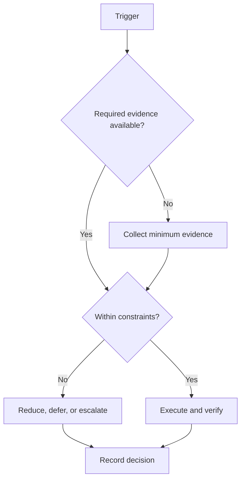

# Work-in-Progress Limits

## Purpose

Limit concurrent commitments to protect flow, feedback, and completion.

## Scope

Limits govern active work, not the idea backlog.

## Theory

Queueing relationships connect work in process, throughput, and cycle time; adding parallel work without capacity tends to lengthen completion.

## Framework

| Element | Rule |
|---|---|
| Active technical projects | Maximum 2; one depth project and one bounded probe |
| Active priority subjects | Maximum 3 at weekly-outcome level |
| Parallel campaign goals | Maximum 3 weekly outcomes |
| Expedite item | Maximum 1; must displace named work |
| Blocked item | Counts against WIP until closed, deferred, or archived |

## Workflow

List active items; classify blocked and waiting work; compare with limits; finish, stop, or defer excess; pull new work only when capacity and dependencies are verified.

## Decision Tree

If a limit would be exceeded, reject the new item unless it is a documented expedite that displaces another item.

## Failure Modes

Renaming tasks to evade limits, leaving blocked work active indefinitely, and treating every opportunity as urgent.

## Recovery

Stop intake, swarm the oldest finishable item, archive invalid work, and review why arrivals exceeded throughput.

## Examples

A third project is not started because two are active; its discovery note remains in the backlog.

## Tables

The framework table is normative. Local values belong in configuration or cycle
records, not this protocol.

## Mermaid Diagrams

The decision tree above defines the control flow for this protocol.

## Cross References

- [Prioritization](prioritization-protocol.md)
- [Weekly System](weekly-system.md)
- [Capacity Model](../02-roadmap/capacity-model.md)

## References

- `SRC-NASA-SE-2016`
- `SRC-LITTLE-1961`
- `SRC-RUBINSTEIN-2001`
- [Source register](../../references/source-register.yml)

## Next Steps

Apply the limits to the current active-work inventory.

## Acceptance Criteria

- [x] Inputs, decisions, evidence, and recovery are explicit.
- [x] No external date or outcome is fabricated.
