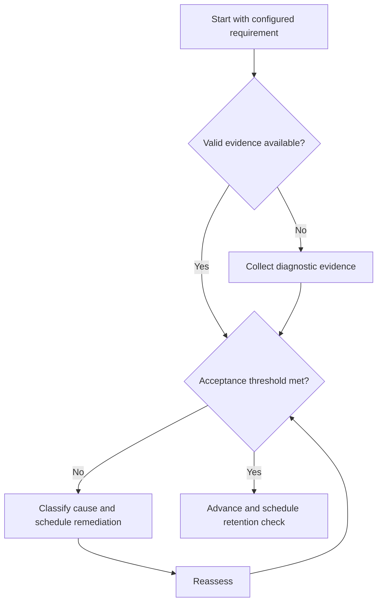

# Study System

## Purpose

Provide canonical navigation for acquiring, retaining, applying, and assessing knowledge.

## Scope

This section implements learning mechanics only; examination configuration belongs to the GATE System.

## Theory

Learning is treated as an observable cycle from diagnostic evidence through retrieval, application, feedback, and delayed reassessment.

## Scientific Basis

Evidence is distinguished from implementation judgment:

- **Evidence:** registered research supporting retrieval, distributed practice,
  feedback-directed practice, or active learning where cited.
- **Best practice:** a conservative engineering translation of evidence into a
  repeatable protocol; effectiveness must be checked locally.
- **Opinion:** an operator preference with no evidentiary claim; record it as a
  configurable choice.

Primary registered sources for this system include `SRC-DUNLOSKY-2013`, `SRC-ROEDIGER-KARPICKE-2006`, `SRC-CEPEDA-2006`, `SRC-ERICSSON-1993`, and `SRC-FREEMAN-2014`.

## Framework

| Element | Operational rule |
|---|---|
| Input | Capability requirement and diagnostic evidence |
| Process | Learn, retrieve, apply, receive feedback, space, reassess |
| Output | Verified explanation, solution, artifact, or assessment |
| Control | Mistake record, mastery rubric, and next decision |

## Workflow

Begin with curriculum integration; run the learning cycle; select technique by objective; capture mistakes; assess mastery after delay.

## Implementation

Use one canonical evidence path per concept and link every practice item to a capability requirement.

## Decision Trees

If assessment is absent, status remains unverified. If evidence is below threshold, return to the earliest failed learning step.

## Failure Modes

Technique collecting, passive rereading, confidence-only mastery, and metrics without decisions.

## Recovery

Return to a representative task, restore feedback, reduce scope, and schedule delayed reassessment.

## Examples

A concept is not complete after reading; it becomes eligible for mastery only after unaided explanation and transfer.

## Tables

The framework table is normative. Personal observations and examination-cycle
values remain in private or cycle-specific configuration.

## Mermaid Diagrams

The decision tree defines the evidence-to-action loop for this document.

## Cross References

- [Curriculum Integration](curriculum-integration.md)
- [Learning Cycle](learning-cycle.md)
- [Note Making](note-making.md)
- [GATE System](../05-gate-system/README.md)

## References

- [Source register](../../references/source-register.yml)
- `SRC-DUNLOSKY-2013`, `SRC-ROEDIGER-KARPICKE-2006`, `SRC-CEPEDA-2006`, `SRC-ERICSSON-1993`, and `SRC-FREEMAN-2014`

## Next Steps

Map the next capability using Curriculum Integration.

## Acceptance Criteria

- [x] Evidence, best practice, and opinion are distinguishable.
- [x] Decisions require evidence and include recovery.
