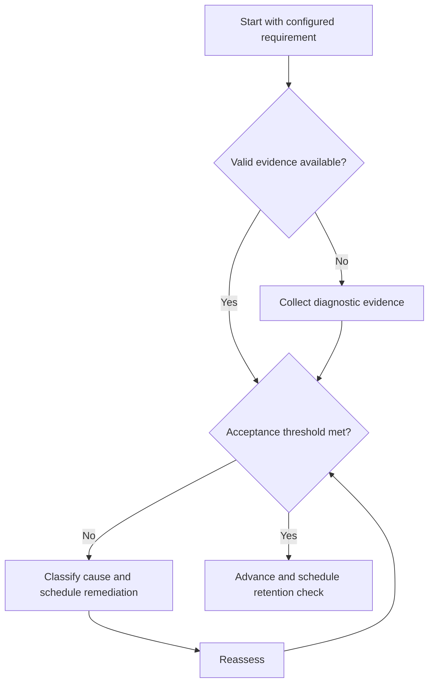

# Active Recall

## Purpose

Use unaided reconstruction to expose accessible knowledge.

## Scope

Active recall covers explanations, diagrams, derivations, and procedures; formal test scheduling is handled by assessment and spacing files.

## Theory

Recognition and familiarity can overstate usable knowledge. Recall produces observable evidence of what can be reconstructed without cues.

## Scientific Basis

Evidence is distinguished from implementation judgment:

- **Evidence:** registered research supporting retrieval, distributed practice,
  feedback-directed practice, or active learning where cited.
- **Best practice:** a conservative engineering translation of evidence into a
  repeatable protocol; effectiveness must be checked locally.
- **Opinion:** an operator preference with no evidentiary claim; record it as a
  configurable choice.

Primary registered sources for this system include `SRC-DUNLOSKY-2013`, `SRC-ROEDIGER-KARPICKE-2006`, `SRC-CEPEDA-2006`, `SRC-ERICSSON-1993`, and `SRC-FREEMAN-2014`.

## Framework

| Element | Operational rule |
|---|---|
| Prompt | Specific enough to score, broad enough to require reconstruction |
| Attempt | Source closed; conditions recorded |
| Score | Required elements, errors, confidence |
| Feedback | Compare only after commitment |
| Disposition | Correct, decompose, or schedule retrieval |

## Workflow

Define answer criteria; close sources; produce the answer; record confidence; compare; annotate omissions and misconceptions; retry after correction.

## Implementation

Use short oral explanations, blank-page diagrams, derivations, and code skeletons. Avoid copying prompts that reveal the answer.

## Decision Trees

If recall fails twice, reduce the retrieval unit and repair the underlying model before another attempt.

## Failure Modes

Flipping a card immediately, accepting vague gist, looking up mid-attempt, and counting recognition as recall.

## Recovery

Return to one missing relationship, generate a discriminating cue, retrieve it after a short delay, then recombine.

## Examples

Draw and explain a pipelined datapath from memory, then compare labels and hazard paths against the reference.

## Tables

The framework table is normative. Personal observations and examination-cycle
values remain in private or cycle-specific configuration.

## Mermaid Diagrams

The decision tree defines the evidence-to-action loop for this document.

## Cross References

- [Retrieval-based assessment](assessment-protocol.md)
- [Learning Cycle](learning-cycle.md)
- [Spaced Practice](spaced-practice.md)

## References

- [Source register](../../references/source-register.yml)
- `SRC-DUNLOSKY-2013`, `SRC-ROEDIGER-KARPICKE-2006`, `SRC-CEPEDA-2006`, `SRC-ERICSSON-1993`, and `SRC-FREEMAN-2014`

## Next Steps

Schedule successful and failed items using Spaced Practice.

## Acceptance Criteria

- [x] Evidence, best practice, and opinion are distinguishable.
- [x] Decisions require evidence and include recovery.
