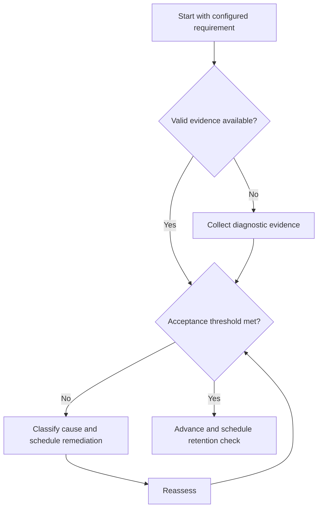

# Assessment Protocol

## Purpose

Design valid diagnostics, formative checks, and mastery assessments.

## Scope

Assessments verify learning outcomes; official examination patterns remain external configuration.

## Theory

An assessment is useful when its task samples the intended capability, conditions are recorded, scoring is reproducible, and results change a decision.

## Scientific Basis

Evidence is distinguished from implementation judgment:

- **Evidence:** registered research supporting retrieval, distributed practice,
  feedback-directed practice, or active learning where cited.
- **Best practice:** a conservative engineering translation of evidence into a
  repeatable protocol; effectiveness must be checked locally.
- **Opinion:** an operator preference with no evidentiary claim; record it as a
  configurable choice.

Primary registered sources for this system include `SRC-DUNLOSKY-2013`, `SRC-ROEDIGER-KARPICKE-2006`, `SRC-CEPEDA-2006`, `SRC-ERICSSON-1993`, and `SRC-FREEMAN-2014`.

## Framework

| Element | Operational rule |
|---|---|
| Diagnostic | Locate starting gaps before instruction |
| Formative | Guide correction during learning |
| Mastery | Verify configured capability threshold |
| Retention | Repeat after delay |
| Transfer | Apply under changed context |
| Calibration | Compare confidence prediction with result |

## Workflow

Define outcome; build a blueprint; select representative items; state conditions and rubric; administer; score; classify errors; decide; retain evidence.

## Implementation

Separate item content, scoring key, attempt, and review. Protect question integrity where reuse matters.

## Decision Trees

Do not infer mastery from an invalid or leaked assessment. Reassess after correction, not immediately with the identical item.

## Failure Modes

Teaching to one item, changing conditions silently, scoring only totals, and using assessment without a follow-up decision.

## Recovery

Repair blueprint coverage, replace compromised items, standardize conditions, and repeat after an appropriate delay.

## Examples

A digital-logic assessment includes derivation, implementation, verification, and one novel method-selection item.

## Tables

The framework table is normative. Personal observations and examination-cycle
values remain in private or cycle-specific configuration.

## Mermaid Diagrams

The decision tree defines the evidence-to-action loop for this document.

## Cross References

- [Concept Mastery](concept-mastery-rubric.md)
- [Error Log](error-log-protocol.md)
- [GATE Diagnostics](../05-gate-system/diagnostic-tests.md)

## References

- [Source register](../../references/source-register.yml)
- `SRC-DUNLOSKY-2013`, `SRC-ROEDIGER-KARPICKE-2006`, `SRC-CEPEDA-2006`, `SRC-ERICSSON-1993`, and `SRC-FREEMAN-2014`

## Next Steps

Feed results into the applicable revision framework.

## Acceptance Criteria

- [x] Evidence, best practice, and opinion are distinguishable.
- [x] Decisions require evidence and include recovery.
