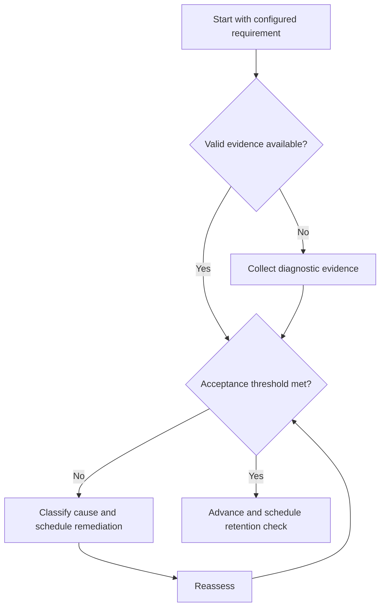

# Concept Mastery Rubric

## Purpose

Classify concept capability using observable evidence.

## Scope

The rubric supports local planning and does not predict examination rank or professional performance.

## Theory

Mastery is multidimensional: recall, explanation, application, verification, transfer, and retention can diverge.

## Scientific Basis

Evidence is distinguished from implementation judgment:

- **Evidence:** registered research supporting retrieval, distributed practice,
  feedback-directed practice, or active learning where cited.
- **Best practice:** a conservative engineering translation of evidence into a
  repeatable protocol; effectiveness must be checked locally.
- **Opinion:** an operator preference with no evidentiary claim; record it as a
  configurable choice.

Primary registered sources for this system include `SRC-DUNLOSKY-2013`, `SRC-ROEDIGER-KARPICKE-2006`, `SRC-CEPEDA-2006`, `SRC-ERICSSON-1993`, and `SRC-FREEMAN-2014`.

## Framework

| Element | Operational rule |
|---|---|
| 0 — Unassessed | No valid evidence |
| 1 — Recognizes | Identifies terms but cannot reconstruct |
| 2 — Reconstructs | Explains core model with support or minor gaps |
| 3 — Applies | Solves representative tasks independently and verifies |
| 4 — Transfers | Selects and applies in a novel or mixed context |
| Retention qualifier | Level reproduced after configured delay |

## Workflow

Select a representative task; predict score; attempt unaided; apply rubric dimensions; link evidence and errors; schedule delayed reassessment.

## Implementation

Record dimension scores separately when useful. Overall status cannot exceed the lowest mandatory dimension.

## Decision Trees

Advance at the configured threshold only after delayed evidence; otherwise remediate the failed dimension.

## Failure Modes

Scoring from confidence, averaging away a critical failure, using one easy item, and treating exposure as level 2.

## Recovery

Return to the failed dimension, choose a targeted task, obtain feedback, and reassess under comparable conditions.

## Examples

A learner may explain Fourier transform properties but score lower on method selection in mixed signal problems.

## Tables

The framework table is normative. Personal observations and examination-cycle
values remain in private or cycle-specific configuration.

## Mermaid Diagrams

The decision tree defines the evidence-to-action loop for this document.

## Cross References

- [Assessment Protocol](assessment-protocol.md)
- [Problem Solving](problem-solving.md)
- [GATE Score Analysis](../05-gate-system/score-analysis.md)

## References

- [Source register](../../references/source-register.yml)
- `SRC-DUNLOSKY-2013`, `SRC-ROEDIGER-KARPICKE-2006`, `SRC-CEPEDA-2006`, `SRC-ERICSSON-1993`, and `SRC-FREEMAN-2014`

## Next Steps

Use the rubric result to schedule assessment and revision.

## Acceptance Criteria

- [x] Evidence, best practice, and opinion are distinguishable.
- [x] Decisions require evidence and include recovery.
