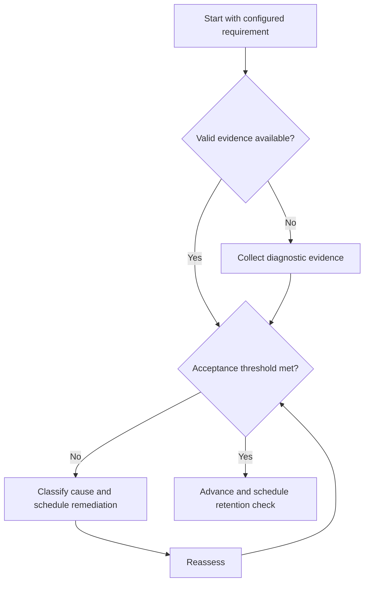

# Curriculum Integration

## Purpose

Connect external curricula and campaign objectives without duplicating content.

## Scope

The file maps requirements, prerequisites, evidence, and assessments; it does not define an official syllabus.

## Theory

Curriculum coherence depends on prerequisite order, aligned assessment, and transfer from representations to engineering tasks.

## Scientific Basis

Evidence is distinguished from implementation judgment:

- **Evidence:** registered research supporting retrieval, distributed practice,
  feedback-directed practice, or active learning where cited.
- **Best practice:** a conservative engineering translation of evidence into a
  repeatable protocol; effectiveness must be checked locally.
- **Opinion:** an operator preference with no evidentiary claim; record it as a
  configurable choice.

Primary registered sources for this system include `SRC-DUNLOSKY-2013`, `SRC-ROEDIGER-KARPICKE-2006`, `SRC-CEPEDA-2006`, `SRC-ERICSSON-1993`, and `SRC-FREEMAN-2014`.

## Framework

| Element | Operational rule |
|---|---|
| Requirement | Stable local ID plus versioned external source |
| Prerequisite | Evidence required before the node |
| Learning outcome | Observable verb and conditions |
| Assessment | Representative task and acceptance rule |
| Artifact | Canonical evidence link |

## Workflow

Register the external source; decompose outcomes; map prerequisites; identify shared evidence; assign assessments; review orphan and circular nodes.

## Implementation

Store mutable curricula as configuration references. Keep concepts and evidence reusable across examination, course, and project contexts.

## Decision Trees

Block a node when mandatory prerequisite evidence is absent; otherwise permit a bounded diagnostic attempt.

## Failure Modes

Copying an external syllabus into several files, mapping topics without outcomes, and aligning only by labels.

## Recovery

Restore the authoritative source version, remove duplicates, and repair the earliest broken prerequisite.

## Examples

A signals concept may support a course, GATE configuration, and DSP project through one canonical mastery record.

## Tables

The framework table is normative. Personal observations and examination-cycle
values remain in private or cycle-specific configuration.

## Mermaid Diagrams

The decision tree defines the evidence-to-action loop for this document.

## Cross References

- [Knowledge dependency map](../02-roadmap/dependency-map.md)
- [Concept Mastery Rubric](concept-mastery-rubric.md)
- [Syllabus Map](../05-gate-system/syllabus-map.md)

## References

- [Source register](../../references/source-register.yml)
- `SRC-DUNLOSKY-2013`, `SRC-ROEDIGER-KARPICKE-2006`, `SRC-CEPEDA-2006`, `SRC-ERICSSON-1993`, and `SRC-FREEMAN-2014`

## Next Steps

Run the Learning Cycle for the first mapped outcome.

## Acceptance Criteria

- [x] Evidence, best practice, and opinion are distinguishable.
- [x] Decisions require evidence and include recovery.
