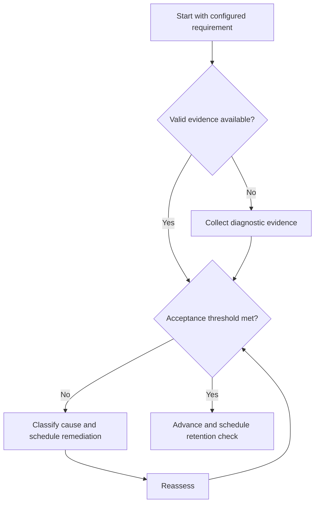

# Error Log Protocol

## Purpose

Convert mistakes into classified, scheduled corrective actions.

## Scope

The log records learning and execution defects; personal blame and clinical interpretation are excluded.

## Theory

An error becomes useful when its observable symptom, root cause, corrective action, recurrence test, and closure evidence are connected.

## Scientific Basis

Evidence is distinguished from implementation judgment:

- **Evidence:** registered research supporting retrieval, distributed practice,
  feedback-directed practice, or active learning where cited.
- **Best practice:** a conservative engineering translation of evidence into a
  repeatable protocol; effectiveness must be checked locally.
- **Opinion:** an operator preference with no evidentiary claim; record it as a
  configurable choice.

Primary registered sources for this system include `SRC-DUNLOSKY-2013`, `SRC-ROEDIGER-KARPICKE-2006`, `SRC-CEPEDA-2006`, `SRC-ERICSSON-1993`, and `SRC-FREEMAN-2014`.

## Framework

| Element | Operational rule |
|---|---|
| Knowledge gap | Missing fact, relation, or prerequisite |
| Conceptual model | Incorrect representation or assumption |
| Method selection | Wrong approach for problem class |
| Execution | Algebra, code, unit, or procedural defect |
| Verification | Failure to test or challenge the result |
| Attention/process | Skipped step or avoidable reading error |
| Confidence | Calibration gap between prediction and result |

## Workflow

Capture the failed item; preserve the original attempt; classify symptom; ask why until actionable; assign correction; schedule recurrence test; close with evidence.

## Implementation

Use stable error IDs and link them to concepts, attempts, confidence, and revision dates. Keep one canonical log.

## Decision Trees

Escalate recurring errors after two failed corrections to prerequisite review or method change.

## Failure Modes

Logging only the correct answer, using vague labels such as careless, deleting failed attempts, and never closing entries.

## Recovery

Restore original evidence, choose a specific cause, practice a discriminating example, and retest after delay.

## Examples

A sign error caused by an unrecorded reference direction is classified as representation/process, not merely arithmetic.

## Tables

The framework table is normative. Personal observations and examination-cycle
values remain in private or cycle-specific configuration.

## Mermaid Diagrams

The decision tree defines the evidence-to-action loop for this document.

## Cross References

- [Learning Cycle](learning-cycle.md)
- [Assessment Protocol](assessment-protocol.md)
- [GATE Error Taxonomy](../05-gate-system/error-taxonomy.md)

## References

- [Source register](../../references/source-register.yml)
- `SRC-DUNLOSKY-2013`, `SRC-ROEDIGER-KARPICKE-2006`, `SRC-CEPEDA-2006`, `SRC-ERICSSON-1993`, and `SRC-FREEMAN-2014`

## Next Steps

Use open error IDs to plan the next revision.

## Acceptance Criteria

- [x] Evidence, best practice, and opinion are distinguishable.
- [x] Decisions require evidence and include recovery.
