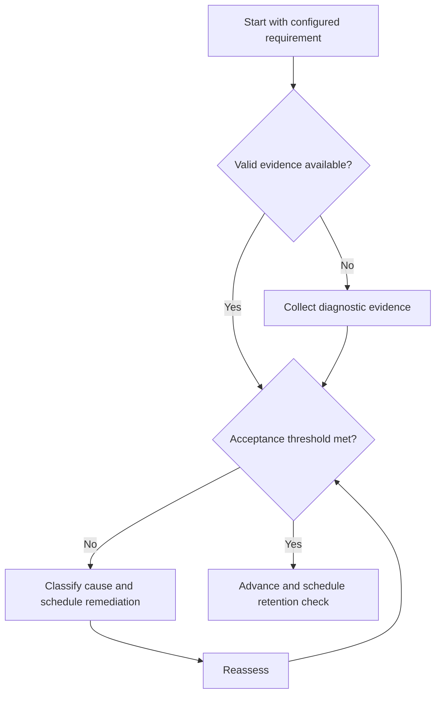

# Interleaving

## Purpose

Mix related problem types to train selection and discrimination.

## Scope

Interleaving follows initial comprehension and does not replace focused repair of a new or severely weak skill.

## Theory

Blocked practice reveals the method in advance; interleaving can require the learner to identify which method applies, though benefits depend on task and implementation.

## Scientific Basis

Evidence is distinguished from implementation judgment:

- **Evidence:** registered research supporting retrieval, distributed practice,
  feedback-directed practice, or active learning where cited.
- **Best practice:** a conservative engineering translation of evidence into a
  repeatable protocol; effectiveness must be checked locally.
- **Opinion:** an operator preference with no evidentiary claim; record it as a
  configurable choice.

Primary registered sources for this system include `SRC-DUNLOSKY-2013`, `SRC-ROEDIGER-KARPICKE-2006`, `SRC-CEPEDA-2006`, `SRC-ERICSSON-1993`, and `SRC-FREEMAN-2014`.

## Framework

| Element | Operational rule |
|---|---|
| Eligible set | Related skills with initial models established |
| Contrast | Problems differ on method-selection features |
| Mix | Order hides the applicable method |
| Feedback | Score method choice separately from execution |
| Spacing | Avoid immediate duplicates where feasible |

## Workflow

Select confusable categories; define diagnostic features; create a balanced mixed set; solve without labels; score selection and execution; remediate patterns.

## Implementation

Begin with small mixes of two or three categories, then widen only when method selection is reliable.

## Decision Trees

If execution fails across all items, return to blocked repair. If only selection fails, contrast defining features.

## Failure Modes

Random mixing without a learning purpose, interleaving before basic understanding, and scoring only final answers.

## Recovery

Separate selection from execution, teach the discriminating feature, run paired contrasts, then restore the mix.

## Examples

Mix transient, steady-state, and frequency-response circuit problems without section labels and score model selection.

## Tables

The framework table is normative. Personal observations and examination-cycle
values remain in private or cycle-specific configuration.

## Mermaid Diagrams

The decision tree defines the evidence-to-action loop for this document.

## Cross References

- [Problem Solving](problem-solving.md)
- [Spaced Practice](spaced-practice.md)
- [Error Log](error-log-protocol.md)

## References

- [Source register](../../references/source-register.yml)
- `SRC-DUNLOSKY-2013`, `SRC-ROEDIGER-KARPICKE-2006`, `SRC-CEPEDA-2006`, `SRC-ERICSSON-1993`, and `SRC-FREEMAN-2014`

## Next Steps

Apply the mixed set through the Problem-Solving protocol.

## Acceptance Criteria

- [x] Evidence, best practice, and opinion are distinguishable.
- [x] Decisions require evidence and include recovery.
