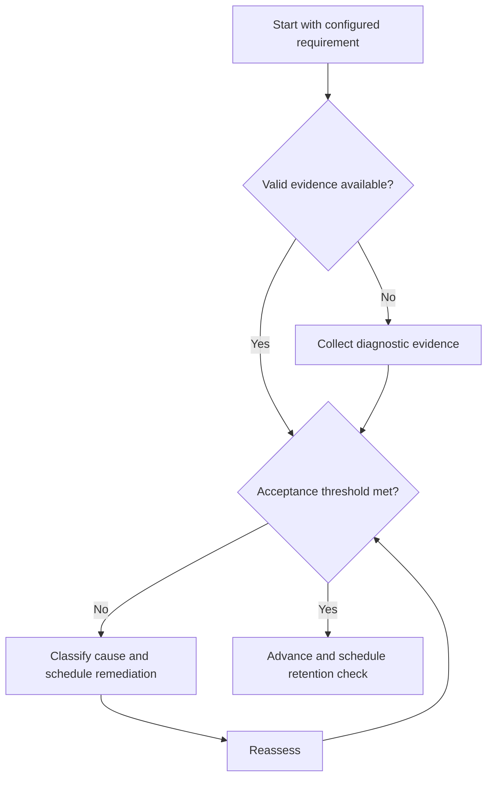

# Learning Cycle

## Purpose

Define the end-to-end control loop for durable engineering learning.

## Scope

The cycle selects and sequences techniques; individual technique rules live in linked files.

## Theory

Durable learning requires more than exposure: retrieval, varied application, corrective feedback, and later reassessment expose what can be used.

## Scientific Basis

Evidence is distinguished from implementation judgment:

- **Evidence:** registered research supporting retrieval, distributed practice,
  feedback-directed practice, or active learning where cited.
- **Best practice:** a conservative engineering translation of evidence into a
  repeatable protocol; effectiveness must be checked locally.
- **Opinion:** an operator preference with no evidentiary claim; record it as a
  configurable choice.

Primary registered sources for this system include `SRC-DUNLOSKY-2013`, `SRC-ROEDIGER-KARPICKE-2006`, `SRC-CEPEDA-2006`, `SRC-ERICSSON-1993`, and `SRC-FREEMAN-2014`.

## Framework

| Element | Operational rule |
|---|---|
| Diagnose | Attempt a representative task before instruction |
| Model | Study the minimum theory and worked structure |
| Retrieve | Reconstruct without the source |
| Apply | Solve or implement under varied conditions |
| Feedback | Compare with tests, solution criteria, or review |
| Space | Schedule delayed retrieval |
| Transfer | Use the idea in a novel context |

## Workflow

Diagnose; select the smallest missing model; retrieve; solve; classify errors; correct; schedule spaced and interleaved practice; reassess transfer.

## Implementation

Create a concept record with requirement, attempt conditions, evidence, error IDs, next retrieval date, and status.

## Decision Trees

Advance only after the mastery rubric passes. A failed transfer task returns to error classification, not automatic rereading.

## Failure Modes

Skipping diagnosis, studying without retrieval, repeating errors before feedback, and ending at immediate fluency.

## Recovery

Reduce task complexity, restore a worked model, practice one discriminating feature, then rebuild variation.

## Examples

After learning nodal analysis, reconstruct the method, solve mixed circuits, explain assumptions, and revisit after delay.

## Tables

The framework table is normative. Personal observations and examination-cycle
values remain in private or cycle-specific configuration.

## Mermaid Diagrams

The decision tree defines the evidence-to-action loop for this document.

## Cross References

- [Active Recall](active-recall.md)
- [Spaced Practice](spaced-practice.md)
- [Error Log](error-log-protocol.md)

## References

- [Source register](../../references/source-register.yml)
- `SRC-DUNLOSKY-2013`, `SRC-ROEDIGER-KARPICKE-2006`, `SRC-CEPEDA-2006`, `SRC-ERICSSON-1993`, and `SRC-FREEMAN-2014`

## Next Steps

Choose the next technique from the diagnosed failure.

## Acceptance Criteria

- [x] Evidence, best practice, and opinion are distinguishable.
- [x] Decisions require evidence and include recovery.
