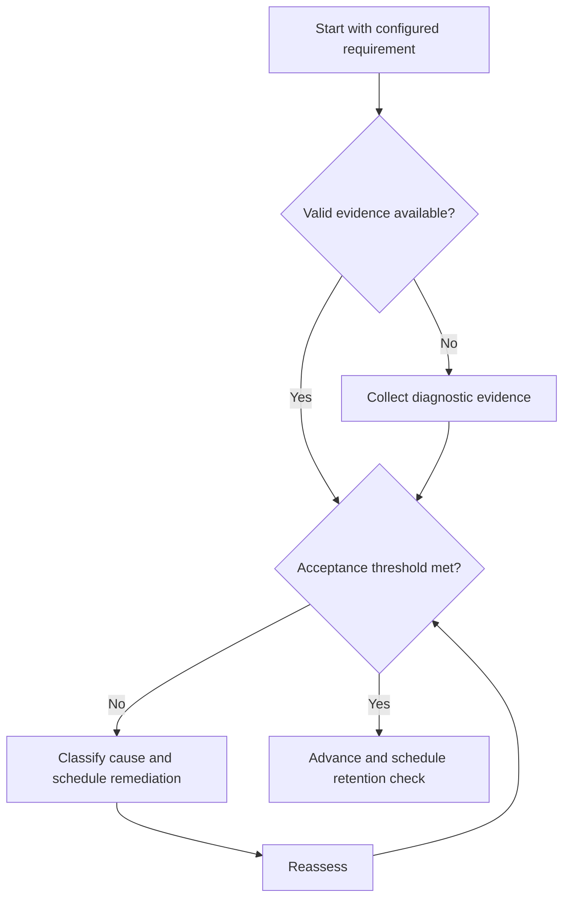

# Note-Making System

## Purpose

Create compact, retrievable engineering notes that support application.

## Scope

Notes summarize owned understanding and evidence links; they do not duplicate textbooks or copyrighted material.

## Theory

Transcription can create exposure without retrieval. Useful notes encode relationships, assumptions, examples, failure boundaries, and questions.

## Scientific Basis

Evidence is distinguished from implementation judgment:

- **Evidence:** registered research supporting retrieval, distributed practice,
  feedback-directed practice, or active learning where cited.
- **Best practice:** a conservative engineering translation of evidence into a
  repeatable protocol; effectiveness must be checked locally.
- **Opinion:** an operator preference with no evidentiary claim; record it as a
  configurable choice.

Primary registered sources for this system include `SRC-DUNLOSKY-2013`, `SRC-ROEDIGER-KARPICKE-2006`, `SRC-CEPEDA-2006`, `SRC-ERICSSON-1993`, and `SRC-FREEMAN-2014`.

## Framework

| Element | Operational rule |
|---|---|
| Concept | One stable topic ID and concise definition |
| Relationships | Prerequisites, consequences, and contrasts |
| Representations | Equation, diagram, verbal model, code where relevant |
| Conditions | Assumptions, units, validity limits |
| Evidence | Source IDs and solved or tested artifact links |
| Retrieval cues | Questions that do not reveal answers |

## Workflow

Read a bounded source; close it; reconstruct the model; reopen and correct; add validity limits and evidence; create retrieval cues; link dependencies.

## Implementation

Prefer atomic notes with stable IDs. Store mutable exam mappings elsewhere and link to the concept note.

## Decision Trees

If a note cannot support an unaided explanation or representative problem, revise it after a learning attempt rather than adding prose.

## Failure Modes

Verbatim copying, decorative formatting, orphan notes, unsupported formulas, and notes without retrieval cues.

## Recovery

Reduce the note to the concept model, correct against sources, add one example and one non-example, then test retrieval.

## Examples

A sampling note states assumptions, spectrum relationship, aliasing boundary, and a question requiring reconstruction.

## Tables

The framework table is normative. Personal observations and examination-cycle
values remain in private or cycle-specific configuration.

## Mermaid Diagrams

The decision tree defines the evidence-to-action loop for this document.

## Cross References

- [Curriculum Integration](curriculum-integration.md)
- [Concept Mastery](concept-mastery-rubric.md)
- [Source Register](../../references/source-register.yml)

## References

- [Source register](../../references/source-register.yml)
- `SRC-DUNLOSKY-2013`, `SRC-ROEDIGER-KARPICKE-2006`, `SRC-CEPEDA-2006`, `SRC-ERICSSON-1993`, and `SRC-FREEMAN-2014`

## Next Steps

Link the note to its concept and assessment record.

## Acceptance Criteria

- [x] Evidence, best practice, and opinion are distinguishable.
- [x] Decisions require evidence and include recovery.
