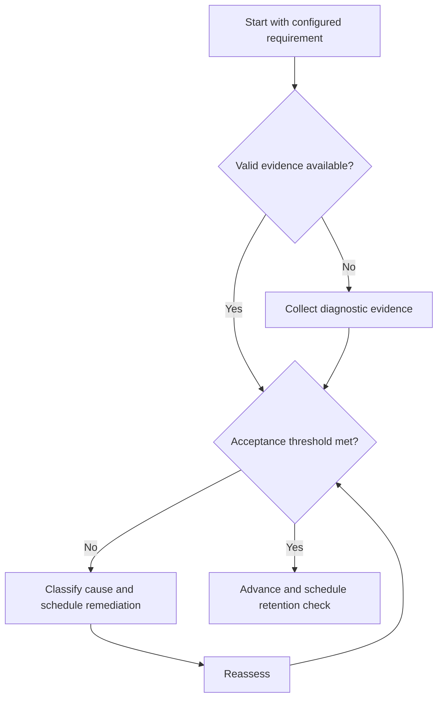

# Problem-Solving Protocol

## Purpose

Produce traceable engineering solutions rather than answer-only practice.

## Scope

The protocol is domain-independent and does not provide subject content.

## Theory

Expert performance depends on problem representation, method selection, execution, verification, and reflection—not only result matching.

## Scientific Basis

Evidence is distinguished from implementation judgment:

- **Evidence:** registered research supporting retrieval, distributed practice,
  feedback-directed practice, or active learning where cited.
- **Best practice:** a conservative engineering translation of evidence into a
  repeatable protocol; effectiveness must be checked locally.
- **Opinion:** an operator preference with no evidentiary claim; record it as a
  configurable choice.

Primary registered sources for this system include `SRC-DUNLOSKY-2013`, `SRC-ROEDIGER-KARPICKE-2006`, `SRC-CEPEDA-2006`, `SRC-ERICSSON-1993`, and `SRC-FREEMAN-2014`.

## Framework

| Element | Operational rule |
|---|---|
| Represent | Knowns, unknowns, constraints, assumptions, units |
| Plan | Candidate model and governing relations |
| Execute | Traceable steps or code |
| Verify | Units, limiting cases, tests, alternative method |
| Explain | Why the method applies and where it fails |
| Classify | Record root cause of any defect |

## Workflow

Attempt unaided; mark assumptions; choose method; execute; verify; compare with criteria; classify errors; write one transfer question.

## Implementation

Preserve intermediate reasoning and test evidence. Time limits are applied only after correctness and verification are stable.

## Decision Trees

If representation is wrong, stop calculation and repair the model. If arithmetic alone fails, correct and test recurrence.

## Failure Modes

Pattern matching by surface features, answer peeking, unit omission, and repeating near-identical examples.

## Recovery

Return to the earliest defective step, solve a smaller contrast case, and repeat with a changed surface form.

## Examples

Before computing amplifier gain, state the operating region and approximations, then verify the result against limits.

## Tables

The framework table is normative. Personal observations and examination-cycle
values remain in private or cycle-specific configuration.

## Mermaid Diagrams

The decision tree defines the evidence-to-action loop for this document.

## Cross References

- [Concept Mastery](concept-mastery-rubric.md)
- [Error Log](error-log-protocol.md)
- [GATE Problem Cycle](../05-gate-system/problem-practice-cycle.md)

## References

- [Source register](../../references/source-register.yml)
- `SRC-DUNLOSKY-2013`, `SRC-ROEDIGER-KARPICKE-2006`, `SRC-CEPEDA-2006`, `SRC-ERICSSON-1993`, and `SRC-FREEMAN-2014`

## Next Steps

Log defects and schedule a transfer problem.

## Acceptance Criteria

- [x] Evidence, best practice, and opinion are distinguishable.
- [x] Decisions require evidence and include recovery.
