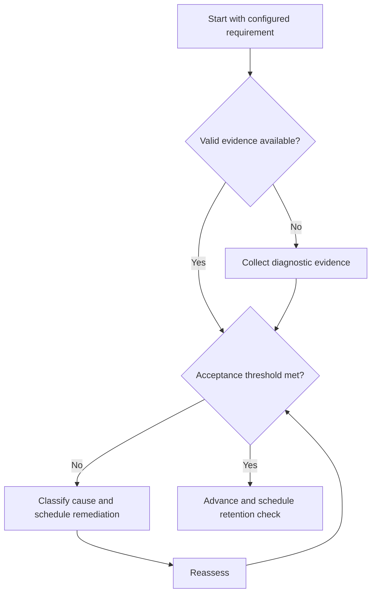

# Spaced Practice

## Purpose

Distribute retrieval and application across time to measure retention.

## Scope

Intervals are configurable and evidence-driven; no universal schedule is prescribed.

## Theory

Distributed practice generally supports longer retention than massed repetition, while the useful gap depends on retention horizon, difficulty, and prior success.

## Scientific Basis

Evidence is distinguished from implementation judgment:

- **Evidence:** registered research supporting retrieval, distributed practice,
  feedback-directed practice, or active learning where cited.
- **Best practice:** a conservative engineering translation of evidence into a
  repeatable protocol; effectiveness must be checked locally.
- **Opinion:** an operator preference with no evidentiary claim; record it as a
  configurable choice.

Primary registered sources for this system include `SRC-DUNLOSKY-2013`, `SRC-ROEDIGER-KARPICKE-2006`, `SRC-CEPEDA-2006`, `SRC-ERICSSON-1993`, and `SRC-FREEMAN-2014`.

## Framework

| Element | Operational rule |
|---|---|
| Retention horizon | Date or event when capability must remain available |
| Initial gap | Configured from difficulty and prior evidence |
| Success rule | Increase gap after accurate unaided retrieval |
| Failure rule | Repair cause and shorten gap without resetting blindly |
| Overdue rule | Attempt first; do not assume forgetting |

## Workflow

Set horizon; retrieve; score; classify errors; calculate next interval from policy; mix with other topics; reassess before the target horizon.

## Implementation

Store next-review dates in one scheduler. The scheduler proposes work; mastery status comes from assessment evidence.

## Decision Trees

Lengthen intervals only after valid success. Repeated failures trigger concept remediation rather than increasingly frequent guessing.

## Failure Modes

Mass review before a deadline, fixed intervals for every item, rescheduling without attempting, and confusing scheduler completion with learning.

## Recovery

Attempt the overdue item, repair only demonstrated gaps, choose a shorter evidence-based interval, and monitor recurrence.

## Examples

A correctly retrieved theorem may move to a longer interval; a failed application returns to model repair and an earlier check.

## Tables

The framework table is normative. Personal observations and examination-cycle
values remain in private or cycle-specific configuration.

## Mermaid Diagrams

The decision tree defines the evidence-to-action loop for this document.

## Cross References

- [Active Recall](active-recall.md)
- [Interleaving](interleaving.md)
- [GATE Revision](../05-gate-system/revision-system.md)

## References

- [Source register](../../references/source-register.yml)
- `SRC-DUNLOSKY-2013`, `SRC-ROEDIGER-KARPICKE-2006`, `SRC-CEPEDA-2006`, `SRC-ERICSSON-1993`, and `SRC-FREEMAN-2014`

## Next Steps

Combine spaced items using Interleaving where discrimination is required.

## Acceptance Criteria

- [x] Evidence, best practice, and opinion are distinguishable.
- [x] Decisions require evidence and include recovery.
