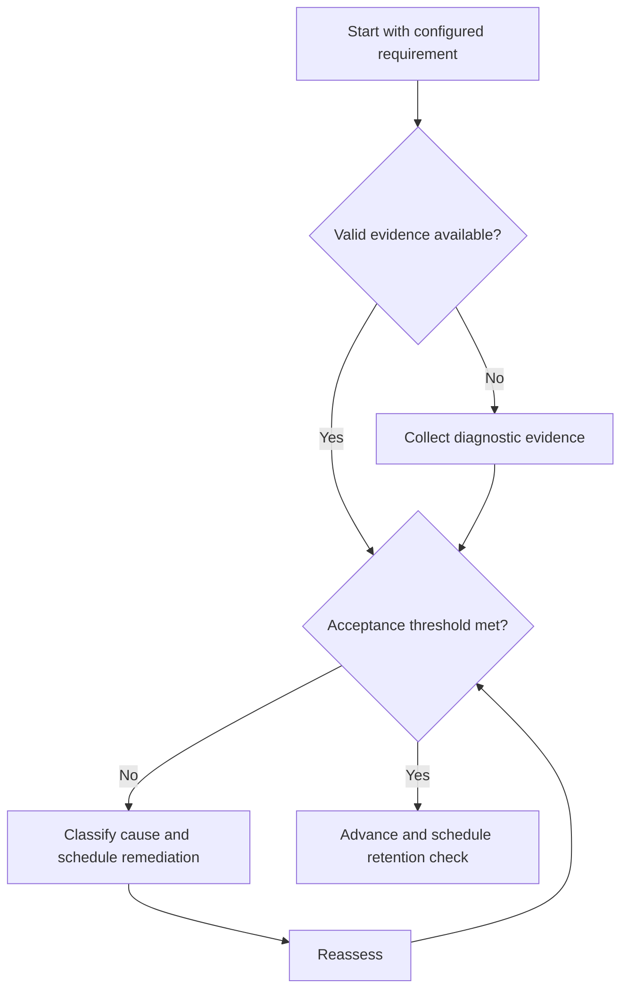

# GATE Execution Framework

## Purpose

Provide canonical navigation for a cycle-configurable examination preparation system.

## Scope

This system never hardcodes official dates, marks, pattern, subjects, syllabus, or question distribution.

## Theory

Examination preparation is modeled as versioned requirements, capability evidence, timed performance evidence, error control, and adaptive planning.

## Scientific Basis

Evidence is distinguished from implementation judgment:

- **Evidence:** registered research supporting retrieval, distributed practice,
  feedback-directed practice, or active learning where cited.
- **Best practice:** a conservative engineering translation of evidence into a
  repeatable protocol; effectiveness must be checked locally.
- **Opinion:** an operator preference with no evidentiary claim; record it as a
  configurable choice.

Primary registered sources for this system include `SRC-DUNLOSKY-2013`, `SRC-ROEDIGER-KARPICKE-2006`, `SRC-CEPEDA-2006`, `SRC-ERICSSON-1993`, and `SRC-FREEMAN-2014`.

## Framework

| Element | Operational rule |
|---|---|
| External configuration | Official source, version, access date, checksum or archive |
| Knowledge layer | Canonical concept IDs and mastery evidence |
| Practice layer | Problems, previous questions, and mocks |
| Control layer | Errors, revision, analysis, and decisions |

## Workflow

Verify official configuration; map syllabus; diagnose; sequence; learn and practice; revise; run mocks; analyze; adapt.

## Implementation

Keep cycle-specific values in configuration and stop when official information is unverified.

## Decision Trees

If configuration changes, preserve prior evidence, diff requirements, and replan only affected nodes.

## Failure Modes

Hard-coded exam facts, copying stale syllabi, score-only reviews, and resource proliferation.

## Recovery

Freeze affected plans, verify an official source, version the change, and regenerate mappings.

## Examples

A new official syllabus version triggers a diff; unchanged concept evidence remains valid if its requirements still match.

## Tables

The framework table is normative. Personal observations and examination-cycle
values remain in private or cycle-specific configuration.

## Mermaid Diagrams

The decision tree defines the evidence-to-action loop for this document.

## Cross References

- [Syllabus Map](syllabus-map.md)
- [Concept Cycle](concept-cycle.md)
- [Study System](../04-study-system/README.md)
- [Roadmap](../02-roadmap/README.md)

## References

- [Source register](../../references/source-register.yml)
- `SRC-DUNLOSKY-2013`, `SRC-ROEDIGER-KARPICKE-2006`, `SRC-CEPEDA-2006`, `SRC-ERICSSON-1993`, and `SRC-FREEMAN-2014`

## Next Steps

Initialize the versioned Syllabus Map.

## Acceptance Criteria

- [x] Evidence, best practice, and opinion are distinguishable.
- [x] Decisions require evidence and include recovery.

---

## Exam Strategy (Operational — Rounak)

### Exam Targets

| Exam | Target | Priority |
|---|---|---|
| **GATE ECE** | AIR < 250 (targeting 2-digit AIR) | Primary |
| **GATE EIE** | AIR < 250 | Secondary |
| **IIT JAM Mathematics** | Good rank (AIR < 250) | Tertiary |
| **UPSC ESE** | IRMS / ECE Service | Optional |
| **PSU Exams** | PGCIL, ISRO, BARC, DRDO | Fallback |

### 184-Day Syllabus Calendar

| Month | GATE ECE Focus | GATE EIE Focus | JAM MA Focus |
|---|---|---|---|
| **August** | Engineering Mathematics, Networks, Signals & Systems | ECE core (same) | Linear Algebra, Calculus |
| **September** | Electronic Devices, Analog Circuits, Digital Circuits | ECE + Sensors intro | Differential Equations, Probability |
| **October** | Control Systems, Communication Systems, EMFT | Sensors, Transducers, Instrumentation | Complex Analysis, Statistics |
| **November** | Full syllabus revision | Industrial Instrumentation | Full revision |
| **December** | Mock tests (1/week) | Practice tests | Practice tests |
| **January** | Final preparation + mocks | Final preparation | Final preparation |

**Study Hours:** Minimum 2 hours/day (GATE/ECE block) as specified in daily schedule.

### Syllabus Overlap Analysis (Cross-Exam ROI)

| Topic | GATE ECE | GATE EIE | JAM MA | Priority |
|---|---|---|---|---|
| **Engineering Mathematics** | ✅ | ✅ | ✅ | **EXTREME** |
| **Linear Algebra** | ✅ | ✅ | ✅ | **EXTREME** |
| **Calculus** | ✅ | ✅ | ✅ | **EXTREME** |
| **Probability & Statistics** | ✅ | ✅ | ✅ | **EXTREME** |
| **Differential Equations** | ✅ | ✅ | ✅ | HIGH |
| **General Aptitude** | ✅ | ✅ | ✅ | **EXTREME** |
| **Networks, Signals & Systems** | ✅ | ✅ | — | HIGH |
| **Electronic Devices** | ✅ | ✅ | — | HIGH |
| **Analog Circuits** | ✅ | ✅ | — | HIGH |
| **Digital Circuits** | ✅ | ✅ | — | HIGH |
| **Control Systems** | ✅ | ✅ | — | HIGH |
| **Communications** | ✅ | — | — | HIGH |
| **Sensors & Instrumentation** | — | ✅ | — | HIGH (EIE) |

### Fallback Plan

| Scenario | Response |
|---|---|
| GATE ECE < AIR 250 | GATE EIE as backup, PSU applications, freelancing |
| All GATE exams miss target | IIT JAM MA or direct MS applications (DAAD, MITACS) |
| UPSC ESE not attempted | Focus on placement + GATE prep, ESE deferred |
| PSU applications rejected | Continue placement + freelancing |

### Learning Science Protocols

All GATE preparation must use evidence-based learning methods:

| Method | Application | Evidence Source |
|---|---|---|
| **Spaced Repetition** | Anki flashcards for formulas, concepts | SRC-CEPEDA-2006 |
| **Active Recall** | Solve problems from memory before checking notes | SRC-ROEDIGER-KARPICKE-2006 |
| **Interleaving** | Mix topics in revision sessions | SRC-DUNLOSKY-2013 |
| **Deliberate Practice** | Focus on weak areas, not comfortable topics | SRC-ERICSSON-1993 |
| **Error Log** | Track every mistake; classify by concept and type | Local evidence |

### Therapy-Academic Integration

| Therapy | Academic Benefit |
|---|---|
| Mirror Protocol | Builds confidence to face difficult topics |
| Re-Scripting | Reframes "This is too hard" as "I am learning" |
| Observer Practice | Improves focus and attention span |
| Cognitive Restructuring | Challenges catastrophizing about exam scores |
| Gratitude Audit | Shifts focus to progress made, not gaps remaining |

### PSU Exam Strategy

**GATE prep covers ~70% of PSU syllabus.**

- **September–October:** Apply to all PSUs (PGCIL, ISRO, BARC, DRDO, BHEL, NTPC)
- **November–December:** PSU-specific preparation (additional topics)
- **January:** Appear for exams

### Cross References (Updated)

- [GATE Targets](../01-charter/GOALS.md) — Goal 11 (GATE ECE and EIE)
- [Exam Targets](../01-charter/TARGETS.md) — Numerical targets for all exams
- [184-Day Structure](../02-roadmap/184-DAY-STRUCTURE.md) — Phase timing
- [Resource Directory](../../references/RESOURCE-DIRECTORY.md) — Books and courses for GATE prep

