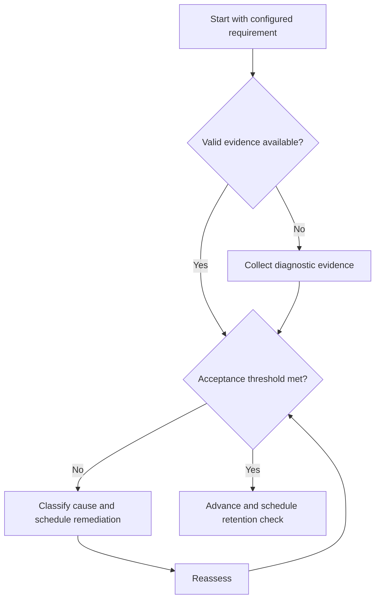

# GATE Execution Framework

## Purpose

Provide canonical navigation for a cycle-configurable examination preparation system.

## Scope

This system never hardcodes official dates, marks, pattern, subjects, syllabus, or question distribution.

## Theory

Examination preparation is modeled as versioned requirements, capability evidence, timed performance evidence, error control, and adaptive planning.

## Scientific Basis

Evidence is distinguished from implementation judgment:

- **Evidence:** registered research supporting retrieval, distributed practice,
  feedback-directed practice, or active learning where cited.
- **Best practice:** a conservative engineering translation of evidence into a
  repeatable protocol; effectiveness must be checked locally.
- **Opinion:** an operator preference with no evidentiary claim; record it as a
  configurable choice.

Primary registered sources for this system include `SRC-DUNLOSKY-2013`, `SRC-ROEDIGER-KARPICKE-2006`, `SRC-CEPEDA-2006`, `SRC-ERICSSON-1993`, and `SRC-FREEMAN-2014`.

## Framework

| Element | Operational rule |
|---|---|
| External configuration | Official source, version, access date, checksum or archive |
| Knowledge layer | Canonical concept IDs and mastery evidence |
| Practice layer | Problems, previous questions, and mocks |
| Control layer | Errors, revision, analysis, and decisions |

## Workflow

Verify official configuration; map syllabus; diagnose; sequence; learn and practice; revise; run mocks; analyze; adapt.

## Implementation

Keep cycle-specific values in configuration and stop when official information is unverified.

## Decision Trees

If configuration changes, preserve prior evidence, diff requirements, and replan only affected nodes.

## Failure Modes

Hard-coded exam facts, copying stale syllabi, score-only reviews, and resource proliferation.

## Recovery

Freeze affected plans, verify an official source, version the change, and regenerate mappings.

## Examples

A new official syllabus version triggers a diff; unchanged concept evidence remains valid if its requirements still match.

## Tables

The framework table is normative. Personal observations and examination-cycle
values remain in private or cycle-specific configuration.

## Mermaid Diagrams

The decision tree defines the evidence-to-action loop for this document.

## Cross References

- [Syllabus Map](syllabus-map.md)
- [Concept Cycle](concept-cycle.md)
- [Study System](../04-study-system/README.md)
- [Roadmap](../02-roadmap/README.md)

## References

- [Source register](../../references/source-register.yml)
- `SRC-DUNLOSKY-2013`, `SRC-ROEDIGER-KARPICKE-2006`, `SRC-CEPEDA-2006`, `SRC-ERICSSON-1993`, and `SRC-FREEMAN-2014`

## Next Steps

Initialize the versioned Syllabus Map.

## Acceptance Criteria

- [x] Evidence, best practice, and opinion are distinguishable.
- [x] Decisions require evidence and include recovery.
