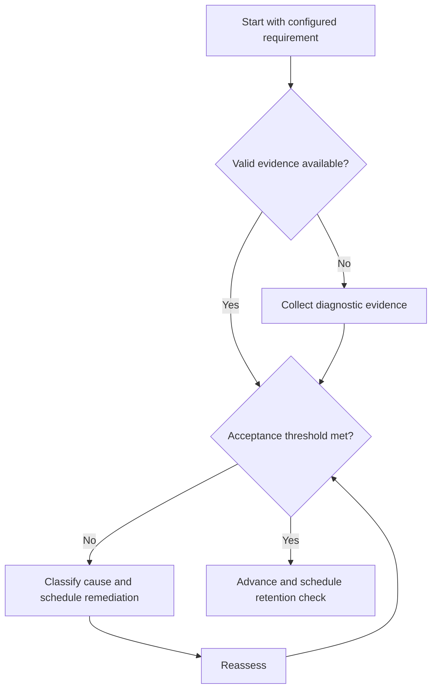

# GATE Concept Cycle

## Purpose

Convert a configured syllabus requirement into retained, applicable capability.

## Scope

The cycle orchestrates the Study System without duplicating its technique protocols.

## Theory

Exam preparation benefits when concept learning, retrieval, problem selection, feedback, revision, and transfer remain linked.

## Scientific Basis

Evidence is distinguished from implementation judgment:

- **Evidence:** registered research supporting retrieval, distributed practice,
  feedback-directed practice, or active learning where cited.
- **Best practice:** a conservative engineering translation of evidence into a
  repeatable protocol; effectiveness must be checked locally.
- **Opinion:** an operator preference with no evidentiary claim; record it as a
  configurable choice.

Primary registered sources for this system include `SRC-DUNLOSKY-2013`, `SRC-ROEDIGER-KARPICKE-2006`, `SRC-CEPEDA-2006`, `SRC-ERICSSON-1993`, and `SRC-FREEMAN-2014`.

## Framework

| Element | Operational rule |
|---|---|
| Map | Requirement and prerequisite IDs |
| Diagnose | Representative pretest |
| Learn | Minimum model and source |
| Retrieve | Unaided explanation or derivation |
| Practice | Representative and mixed problems |
| Review | Error causes and confidence |
| Retain | Delayed reassessment |

## Workflow

Map; diagnose; invoke learning cycle; solve a calibrated set; classify errors; meet mastery threshold; schedule revision.

## Implementation

Store concept status separately from examination-cycle requirement status so knowledge can transfer across cycles.

## Decision Trees

Advance to mixed practice only after representative correctness and explanation; return on recurring conceptual errors.

## Failure Modes

Duplicating notes in GATE files, rushing to problem volume, and treating one correct item as mastery.

## Recovery

Return to the Study System’s failed step, close open error IDs, and retest after delay.

## Examples

A network theorem node is learned once, then linked to every configured requirement that uses it.

## Tables

The framework table is normative. Personal observations and examination-cycle
values remain in private or cycle-specific configuration.

## Mermaid Diagrams

The decision tree defines the evidence-to-action loop for this document.

## Cross References

- [Learning Cycle](../04-study-system/learning-cycle.md)
- [Problem Practice](problem-practice-cycle.md)
- [Revision System](revision-system.md)

## References

- [Source register](../../references/source-register.yml)
- `SRC-DUNLOSKY-2013`, `SRC-ROEDIGER-KARPICKE-2006`, `SRC-CEPEDA-2006`, `SRC-ERICSSON-1993`, and `SRC-FREEMAN-2014`

## Next Steps

Enter the mastered node into mixed problem practice.

## Acceptance Criteria

- [x] Evidence, best practice, and opinion are distinguishable.
- [x] Decisions require evidence and include recovery.
