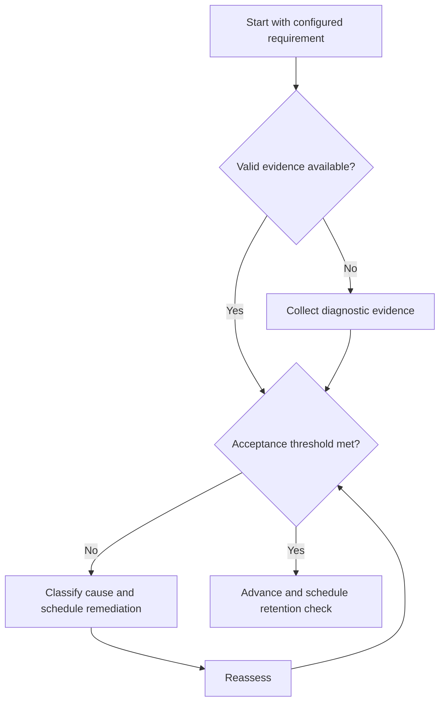

# Diagnostic Tests

## Purpose

Measure starting capability against the configured syllabus map.

## Scope

Diagnostics locate gaps; they do not forecast rank or use a hard-coded examination pattern.

## Theory

Representative pretests reduce planning from confidence alone and reveal prerequisite, method-selection, and execution defects.

## Scientific Basis

Evidence is distinguished from implementation judgment:

- **Evidence:** registered research supporting retrieval, distributed practice,
  feedback-directed practice, or active learning where cited.
- **Best practice:** a conservative engineering translation of evidence into a
  repeatable protocol; effectiveness must be checked locally.
- **Opinion:** an operator preference with no evidentiary claim; record it as a
  configurable choice.

Primary registered sources for this system include `SRC-DUNLOSKY-2013`, `SRC-ROEDIGER-KARPICKE-2006`, `SRC-CEPEDA-2006`, `SRC-ERICSSON-1993`, and `SRC-FREEMAN-2014`.

## Framework

| Element | Operational rule |
|---|---|
| Blueprint | Configured requirement coverage |
| Conditions | Time, aids, environment, and interruptions |
| Response evidence | Original work preserved |
| Scoring | Concept, process, confidence, and error class |
| Decision | Advance, remediate, defer, or reassess |

## Workflow

Select representative items; record conditions and confidence; attempt without instruction; score by requirement; classify errors; update sequence.

## Implementation

Use enough evidence to decide, not an exhaustive mock. Keep official-pattern assumptions external.

## Decision Trees

Low evidence triggers a second diagnostic sample; persistent low performance triggers prerequisite remediation.

## Failure Modes

Studying the diagnostic items first, using total score only, and interpreting unfamiliar formatting as a concept gap.

## Recovery

Replace compromised items, separate format and knowledge errors, and reassess a bounded sample.

## Examples

Two items can reveal a repeated transform prerequisite gap even when the aggregate score appears acceptable.

## Tables

The framework table is normative. Personal observations and examination-cycle
values remain in private or cycle-specific configuration.

## Mermaid Diagrams

The decision tree defines the evidence-to-action loop for this document.

## Cross References

- [Assessment Protocol](../04-study-system/assessment-protocol.md)
- [Error Taxonomy](error-taxonomy.md)
- [Subject Sequencing](subject-sequencing.md)

## References

- [Source register](../../references/source-register.yml)
- `SRC-DUNLOSKY-2013`, `SRC-ROEDIGER-KARPICKE-2006`, `SRC-CEPEDA-2006`, `SRC-ERICSSON-1993`, and `SRC-FREEMAN-2014`

## Next Steps

Start the Concept Cycle for the highest-leverage verified gap.

## Acceptance Criteria

- [x] Evidence, best practice, and opinion are distinguishable.
- [x] Decisions require evidence and include recovery.
