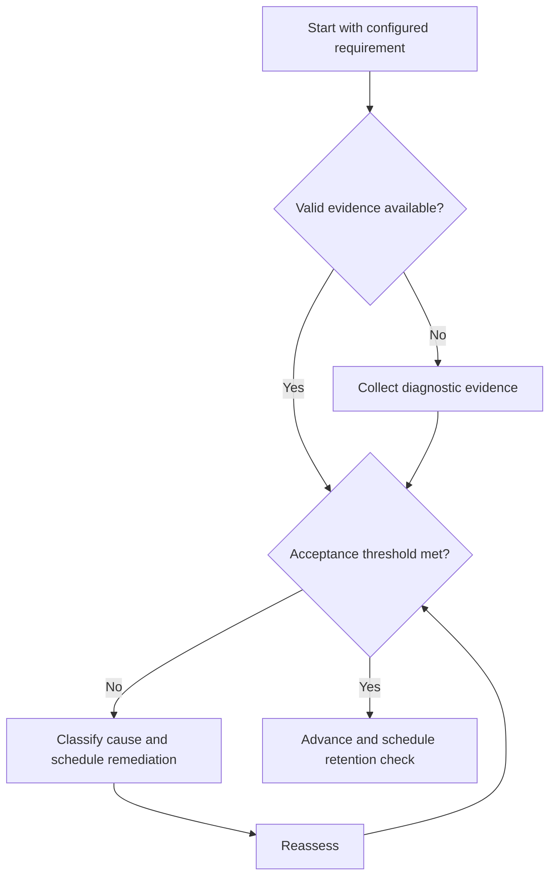

# GATE Error Taxonomy

## Purpose

Classify examination-practice defects into actionable root causes.

## Scope

This taxonomy extends the canonical Study Error Log with exam-context categories.

## Theory

Aggregate score cannot show whether a defect came from knowledge, selection, execution, pacing, interface, confidence, or conditions.

## Scientific Basis

Evidence is distinguished from implementation judgment:

- **Evidence:** registered research supporting retrieval, distributed practice,
  feedback-directed practice, or active learning where cited.
- **Best practice:** a conservative engineering translation of evidence into a
  repeatable protocol; effectiveness must be checked locally.
- **Opinion:** an operator preference with no evidentiary claim; record it as a
  configurable choice.

Primary registered sources for this system include `SRC-DUNLOSKY-2013`, `SRC-ROEDIGER-KARPICKE-2006`, `SRC-CEPEDA-2006`, `SRC-ERICSSON-1993`, and `SRC-FREEMAN-2014`.

## Framework

| Element | Operational rule |
|---|---|
| Knowledge | Missing or inaccessible concept |
| Representation | Problem or diagram modeled incorrectly |
| Method selection | Incorrect approach chosen |
| Execution | Algebra, arithmetic, unit, code, or procedure |
| Verification | No check or invalid check |
| Time/strategy | Poor allocation or navigation |
| Interface | Input, display, or tool-use error |
| Confidence | Prediction materially differs from evidence |
| Condition | Interruption, fatigue, or invalid environment |

## Workflow

Preserve attempt; tag symptom; identify earliest causal defect; link concept and requirement; assign corrective task; schedule recurrence check; close with evidence.

## Implementation

Permit multiple contributing tags but designate one primary actionable cause. Keep sensitive condition details private.

## Decision Trees

When one cause recurs across three reviewed attempts, escalate to method or prerequisite review.

## Failure Modes

Calling every defect careless, tagging only incorrect answers, ignoring correct guesses, and closing without retest.

## Recovery

Reclassify from original work, perform cause-specific remediation, and use an unseen recurrence item.

## Examples

A correct guess with low confidence is a calibration/verification defect even though the scored answer is correct.

## Tables

The framework table is normative. Personal observations and examination-cycle
values remain in private or cycle-specific configuration.

## Mermaid Diagrams

The decision tree defines the evidence-to-action loop for this document.

## Cross References

- [Study Error Log](../04-study-system/error-log-protocol.md)
- [Mock Tests](mock-test-system.md)
- [Score Analysis](score-analysis.md)

## References

- [Source register](../../references/source-register.yml)
- `SRC-DUNLOSKY-2013`, `SRC-ROEDIGER-KARPICKE-2006`, `SRC-CEPEDA-2006`, `SRC-ERICSSON-1993`, and `SRC-FREEMAN-2014`

## Next Steps

Aggregate error evidence in Score Analysis.

## Acceptance Criteria

- [x] Evidence, best practice, and opinion are distinguishable.
- [x] Decisions require evidence and include recovery.
