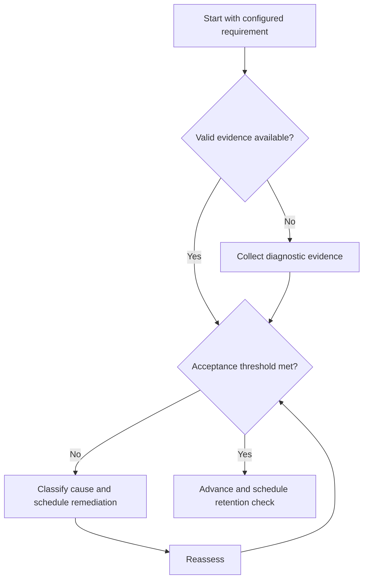

# Mock Test System

## Purpose

Simulate configured examination conditions and produce decision-quality performance evidence.

## Scope

All pattern, duration, scoring, and interface values are supplied by verified cycle configuration.

## Theory

A mock integrates knowledge, retrieval, selection, pacing, attention, and recovery. Its value comes primarily from controlled conditions and review.

## Scientific Basis

Evidence is distinguished from implementation judgment:

- **Evidence:** registered research supporting retrieval, distributed practice,
  feedback-directed practice, or active learning where cited.
- **Best practice:** a conservative engineering translation of evidence into a
  repeatable protocol; effectiveness must be checked locally.
- **Opinion:** an operator preference with no evidentiary claim; record it as a
  configurable choice.

Primary registered sources for this system include `SRC-DUNLOSKY-2013`, `SRC-ROEDIGER-KARPICKE-2006`, `SRC-CEPEDA-2006`, `SRC-ERICSSON-1993`, and `SRC-FREEMAN-2014`.

## Framework

| Element | Operational rule |
|---|---|
| Blueprint | Configured coverage and pattern source |
| Conditions | Duration, environment, aids, interface |
| Execution | Responses, confidence, time, navigation decisions |
| Review | Knowledge, strategy, process, and condition effects |
| Reassessment | Targeted corrective evidence before next mock |

## Workflow

Verify configuration; freeze blueprint; prepare environment; execute; preserve responses; rest; review; classify errors; assign corrections; schedule next mock.

## Implementation

Separate mock execution from detailed review. Compare only tests with materially similar configuration and conditions.

## Decision Trees

Do not increase mock frequency while review debt remains. A compromised mock is practice, not valid performance evidence.

## Failure Modes

Taking many mocks without review, changing rules mid-test, score fixation, and unsafe fatigue.

## Recovery

Close review debt, remediate dominant causes, run smaller timed sections, and return to a full mock when thresholds are met.

## Examples

A low score caused partly by interface errors produces both concept remediation and an execution-environment drill.

## Tables

The framework table is normative. Personal observations and examination-cycle
values remain in private or cycle-specific configuration.

## Mermaid Diagrams

The decision tree defines the evidence-to-action loop for this document.

## Cross References

- [Performance Analysis](score-analysis.md)
- [Error Taxonomy](error-taxonomy.md)
- [Capacity Model](../02-roadmap/capacity-model.md)

## References

- [Source register](../../references/source-register.yml)
- `SRC-DUNLOSKY-2013`, `SRC-ROEDIGER-KARPICKE-2006`, `SRC-CEPEDA-2006`, `SRC-ERICSSON-1993`, and `SRC-FREEMAN-2014`

## Next Steps

Complete error and performance analysis before scheduling another mock.

## Acceptance Criteria

- [x] Evidence, best practice, and opinion are distinguishable.
- [x] Decisions require evidence and include recovery.
