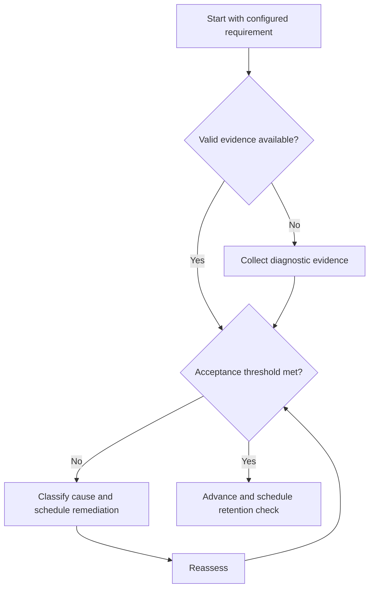

# Previous-Year Question Framework

## Purpose

Use authenticated previous examination questions as evidence without inferring future distributions.

## Scope

The framework governs provenance, tagging, attempts, and analysis; it does not reproduce copyrighted sets.

## Theory

Previous questions can sample historical requirements and task forms, but historical frequency is not a guarantee of future content.

## Scientific Basis

Evidence is distinguished from implementation judgment:

- **Evidence:** registered research supporting retrieval, distributed practice,
  feedback-directed practice, or active learning where cited.
- **Best practice:** a conservative engineering translation of evidence into a
  repeatable protocol; effectiveness must be checked locally.
- **Opinion:** an operator preference with no evidentiary claim; record it as a
  configurable choice.

Primary registered sources for this system include `SRC-DUNLOSKY-2013`, `SRC-ROEDIGER-KARPICKE-2006`, `SRC-CEPEDA-2006`, `SRC-ERICSSON-1993`, and `SRC-FREEMAN-2014`.

## Framework

| Element | Operational rule |
|---|---|
| Provenance | Year/cycle, official or licensed source, identifier |
| Requirement mapping | Versioned syllabus IDs |
| Attempt state | Unseen, attempted, reviewed, reassess |
| Error evidence | Taxonomy and root cause |
| Reuse control | Prevent memorized items from masquerading as transfer |
| Inference limit | Historical evidence only |

## Workflow

Verify source; register metadata; map requirements; attempt under recorded conditions; review; classify; schedule variant or delayed reassessment.

## Implementation

Keep item text only where licensing permits. Store links and metadata otherwise.

## Decision Trees

Exclude unauthenticated or compromised items from performance inference; they may remain illustrative with clear labels.

## Failure Modes

Predicting future weights from counts, leaking solutions, duplicating items, and comparing scores across unlike conditions.

## Recovery

Correct provenance, separate first attempts from repeats, use unseen variants, and restate inference limits.

## Examples

A historically common topic may receive review attention, but priority still uses current official requirements and diagnostic evidence.

## Tables

The framework table is normative. Personal observations and examination-cycle
values remain in private or cycle-specific configuration.

## Mermaid Diagrams

The decision tree defines the evidence-to-action loop for this document.

## Cross References

- [Syllabus Map](syllabus-map.md)
- [Problem Practice](problem-practice-cycle.md)
- [Mock Tests](mock-test-system.md)

## References

- [Source register](../../references/source-register.yml)
- `SRC-DUNLOSKY-2013`, `SRC-ROEDIGER-KARPICKE-2006`, `SRC-CEPEDA-2006`, `SRC-ERICSSON-1993`, and `SRC-FREEMAN-2014`

## Next Steps

Assemble mock blueprints from verified configuration, not historical guesses.

## Acceptance Criteria

- [x] Evidence, best practice, and opinion are distinguishable.
- [x] Decisions require evidence and include recovery.
