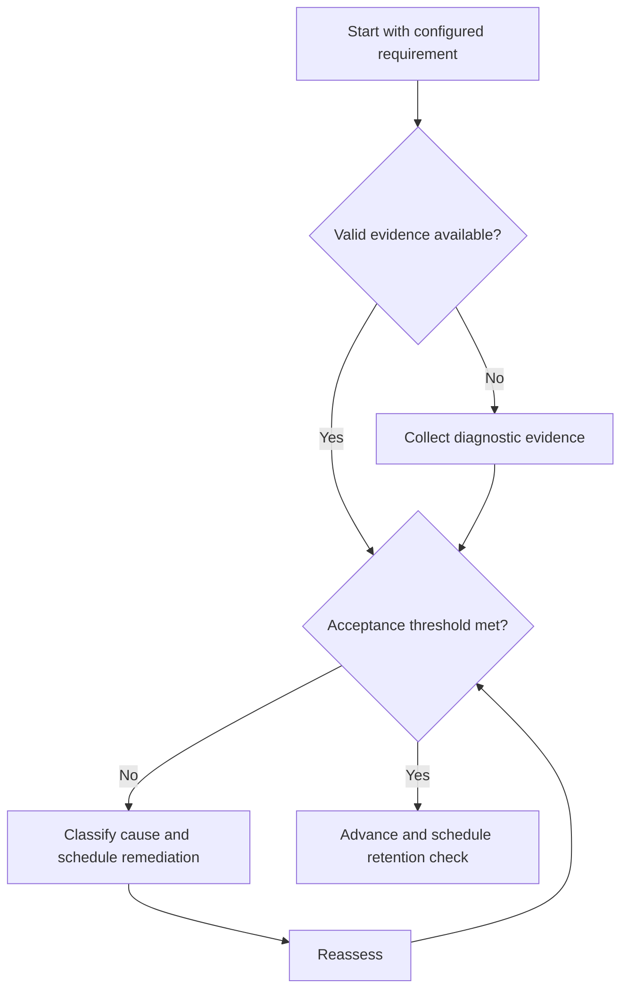

# GATE Problem Practice Cycle

## Purpose

Build accurate problem selection, execution, verification, and timing from configured item pools.

## Scope

The cycle does not assume a question distribution or prescribe a fixed problem count.

## Theory

Practice becomes informative when item purpose, conditions, solution process, errors, and later transfer are captured.

## Scientific Basis

Evidence is distinguished from implementation judgment:

- **Evidence:** registered research supporting retrieval, distributed practice,
  feedback-directed practice, or active learning where cited.
- **Best practice:** a conservative engineering translation of evidence into a
  repeatable protocol; effectiveness must be checked locally.
- **Opinion:** an operator preference with no evidentiary claim; record it as a
  configurable choice.

Primary registered sources for this system include `SRC-DUNLOSKY-2013`, `SRC-ROEDIGER-KARPICKE-2006`, `SRC-CEPEDA-2006`, `SRC-ERICSSON-1993`, and `SRC-FREEMAN-2014`.

## Framework

| Element | Operational rule |
|---|---|
| Calibration | Difficulty and representation known or estimated |
| Selection | Blocked for repair; mixed for discrimination |
| Attempt | Conditions and confidence recorded |
| Review | Method, execution, verification, time |
| Density | Accepted reviewed items per focused practice hour |
| Transfer | Changed surface or combined requirement |

## Workflow

Choose set purpose; attempt; preserve work; verify; classify errors; compare confidence; correct; schedule mixed and delayed items.

## Implementation

Increase time pressure only after accuracy and verification are stable. Track reviewed evidence, not raw item count.

## Decision Trees

When density falls, inspect difficulty, switching, fatigue, and review debt before changing targets.

## Failure Modes

Chasing volume, reading solutions before commitment, skipping review of correct guesses, and timing too early.

## Recovery

Reduce set size, restore full solution protocol, close review debt, and rebuild speed from verified methods.

## Examples

A correct answer with unsupported guessing is reviewed and not counted as accepted practice evidence.

## Tables

The framework table is normative. Personal observations and examination-cycle
values remain in private or cycle-specific configuration.

## Mermaid Diagrams

The decision tree defines the evidence-to-action loop for this document.

## Cross References

- [Problem Solving](../04-study-system/problem-solving.md)
- [PYQ Framework](previous-year-questions.md)
- [Error Taxonomy](error-taxonomy.md)

## References

- [Source register](../../references/source-register.yml)
- `SRC-DUNLOSKY-2013`, `SRC-ROEDIGER-KARPICKE-2006`, `SRC-CEPEDA-2006`, `SRC-ERICSSON-1993`, and `SRC-FREEMAN-2014`

## Next Steps

Introduce verified previous-year questions where configuration permits.

## Acceptance Criteria

- [x] Evidence, best practice, and opinion are distinguishable.
- [x] Decisions require evidence and include recovery.
