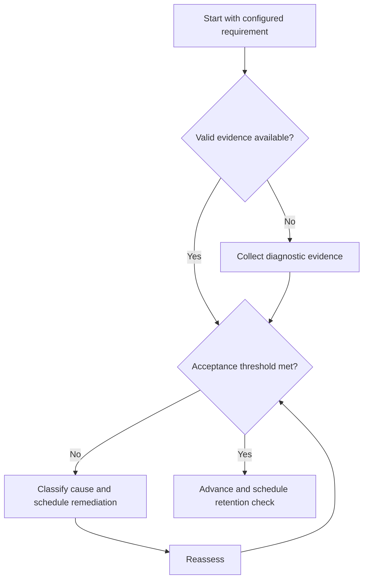

# GATE Revision System

## Purpose

Schedule evidence-based maintenance and remediation across configured requirements.

## Scope

No fixed revision calendar or subject list is embedded.

## Theory

Revision should retrieve and apply knowledge after delay, with priority driven by requirement importance, retention evidence, and error recurrence.

## Scientific Basis

Evidence is distinguished from implementation judgment:

- **Evidence:** registered research supporting retrieval, distributed practice,
  feedback-directed practice, or active learning where cited.
- **Best practice:** a conservative engineering translation of evidence into a
  repeatable protocol; effectiveness must be checked locally.
- **Opinion:** an operator preference with no evidentiary claim; record it as a
  configurable choice.

Primary registered sources for this system include `SRC-DUNLOSKY-2013`, `SRC-ROEDIGER-KARPICKE-2006`, `SRC-CEPEDA-2006`, `SRC-ERICSSON-1993`, and `SRC-FREEMAN-2014`.

## Framework

| Element | Operational rule |
|---|---|
| Due maintenance | Successful concepts reaching configured interval |
| Remediation | Open or recurring error IDs |
| Integration | Mixed sets and mock-derived gaps |
| Confidence | Overconfidence and underconfidence checks |
| Efficiency | Closed priority gaps per revision hour |
| Capacity | Queue limited by available blocks |

## Workflow

Collect due items; rank by requirement and error risk; retrieve before review; apply; score; close or reschedule; monitor queue age.

## Implementation

Use the Study System spacing and mastery rules. Keep the revision queue separate from new-learning intake.

## Decision Trees

If due work exceeds capacity, protect high-dependency and recurring-error items, reduce new intake, and rebaseline.

## Failure Modes

Rereading all notes, equal-frequency review, growing queues, and marking completion without retrieval.

## Recovery

Stop new items, triage by consequence and recurrence, perform minimum evidence checks, and retire obsolete mappings.

## Examples

A retained concept receives a brief mixed check; a recurring misconception receives full concept-cycle remediation.

## Tables

The framework table is normative. Personal observations and examination-cycle
values remain in private or cycle-specific configuration.

## Mermaid Diagrams

The decision tree defines the evidence-to-action loop for this document.

## Cross References

- [Spaced Practice](../04-study-system/spaced-practice.md)
- [Error Taxonomy](error-taxonomy.md)
- [Score Analysis](score-analysis.md)

## References

- [Source register](../../references/source-register.yml)
- `SRC-DUNLOSKY-2013`, `SRC-ROEDIGER-KARPICKE-2006`, `SRC-CEPEDA-2006`, `SRC-ERICSSON-1993`, and `SRC-FREEMAN-2014`

## Next Steps

Feed revision outcomes into adaptive performance review.

## Acceptance Criteria

- [x] Evidence, best practice, and opinion are distinguishable.
- [x] Decisions require evidence and include recovery.
