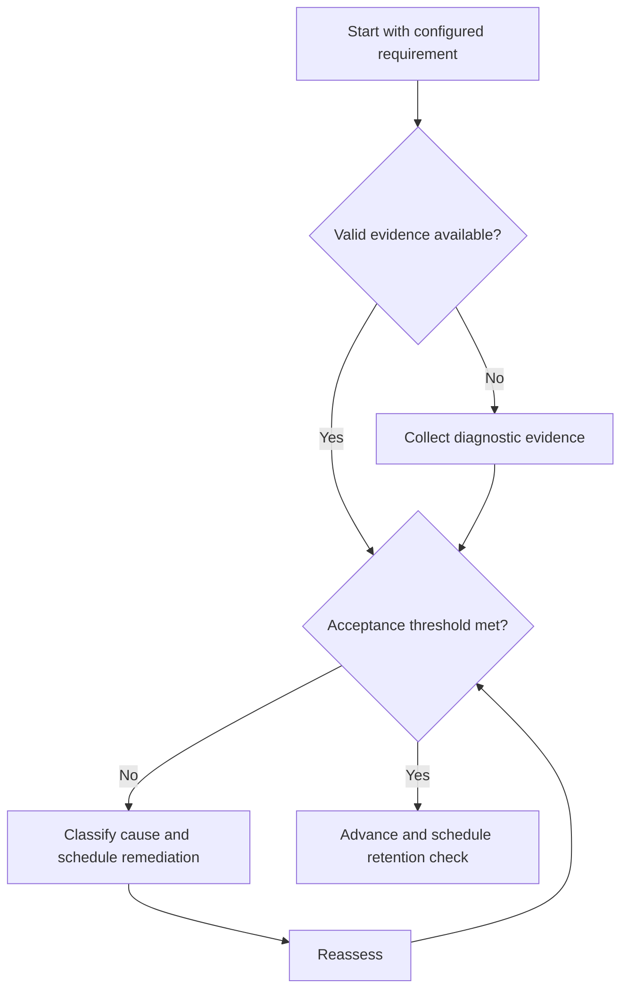

# Score and Performance Analysis

## Purpose

Convert assessment evidence into adaptive decisions without predicting rank.

## Scope

Metrics are configuration-neutral and do not hardcode marks, pattern, or distributions.

## Theory

Performance review should combine controllable leading indicators, lagging assessment evidence, coverage, retention, calibration, and data quality.

## Scientific Basis

Evidence is distinguished from implementation judgment:

- **Evidence:** registered research supporting retrieval, distributed practice,
  feedback-directed practice, or active learning where cited.
- **Best practice:** a conservative engineering translation of evidence into a
  repeatable protocol; effectiveness must be checked locally.
- **Opinion:** an operator preference with no evidentiary claim; record it as a
  configurable choice.

Primary registered sources for this system include `SRC-DUNLOSKY-2013`, `SRC-ROEDIGER-KARPICKE-2006`, `SRC-CEPEDA-2006`, `SRC-ERICSSON-1993`, and `SRC-FREEMAN-2014`.

## Framework

| Element | Operational rule |
|---|---|
| Leading indicators | Reviewed practice, due revision closure, open error age |
| Lagging indicators | Configured assessment and mock outcomes |
| Learning velocity | New mastery units verified per study hour |
| Retention | Delayed reassessment success rate |
| Revision efficiency | Priority gaps closed per revision hour |
| Practice density | Accepted reviewed items per focused hour |
| Knowledge coverage | Verified requirements / configured requirements |
| Consistency | Planned evidence cycles completed across periods |
| Confidence | Calibration error between prediction and result |

## Workflow

Validate data; segment by requirement and error cause; compute configured formulas; inspect trends and coverage; identify bottleneck; choose one adaptive change; review later.

## Implementation

Every metric entry requires formula, unit, source, period, coverage, and action thresholds. Insufficient data is an allowed status.

## Decision Trees

Change sequence, practice mix, revision load, or assessment cadence only when evidence supports the cause.

## Failure Modes

Optimizing total score alone, comparing incompatible mocks, gaming counts, and treating correlation as cause.

## Recovery

Repair data quality, return to disaggregated evidence, run a bounded intervention, and evaluate at the next comparable assessment.

## Examples

Flat aggregate results with falling method-selection errors and rising execution errors call for execution repair, not complete curriculum restart.

## Tables

The framework table is normative. Personal observations and examination-cycle
values remain in private or cycle-specific configuration.

## Mermaid Diagrams

The decision tree defines the evidence-to-action loop for this document.

## Cross References

- [Controllables vs Outcomes](../01-charter/controllables-vs-outcomes.md)
- [Mock Tests](mock-test-system.md)
- [Revision System](revision-system.md)

## References

- [Source register](../../references/source-register.yml)
- `SRC-DUNLOSKY-2013`, `SRC-ROEDIGER-KARPICKE-2006`, `SRC-CEPEDA-2006`, `SRC-ERICSSON-1993`, and `SRC-FREEMAN-2014`

## Next Steps

Issue the next continue, change, defer, or remediate decision.

## Acceptance Criteria

- [x] Evidence, best practice, and opinion are distinguishable.
- [x] Decisions require evidence and include recovery.
