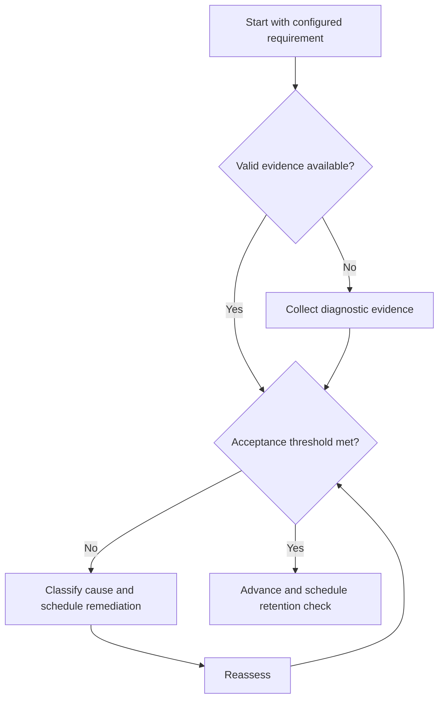

# Subject Sequencing

## Purpose

Order configured syllabus units by prerequisite leverage, diagnostic need, and available capacity.

## Scope

The framework does not prescribe a subject list or universal order.

## Theory

Sequence affects rework: high-dependency prerequisites and shared concepts can unlock multiple later requirements.

## Scientific Basis

Evidence is distinguished from implementation judgment:

- **Evidence:** registered research supporting retrieval, distributed practice,
  feedback-directed practice, or active learning where cited.
- **Best practice:** a conservative engineering translation of evidence into a
  repeatable protocol; effectiveness must be checked locally.
- **Opinion:** an operator preference with no evidentiary claim; record it as a
  configurable choice.

Primary registered sources for this system include `SRC-DUNLOSKY-2013`, `SRC-ROEDIGER-KARPICKE-2006`, `SRC-CEPEDA-2006`, `SRC-ERICSSON-1993`, and `SRC-FREEMAN-2014`.

## Framework

| Element | Operational rule |
|---|---|
| Prerequisite centrality | Downstream nodes blocked |
| Diagnostic gap | Distance from configured mastery threshold |
| Transfer value | Reuse across requirements or engineering work |
| Resource readiness | Verified materials and assessment available |
| Capacity fit | Work fits current phase and semester constraints |
| Decay risk | Need for continuing retrieval before target horizon |

## Workflow

Load configured units; verify dependency graph; add diagnostic evidence; score factors; select within WIP limits; schedule reassessment.

## Implementation

Sequence one primary unit and bounded secondary maintenance work. Recompute after gates or official changes.

## Decision Trees

A mandatory prerequisite outranks a higher-interest downstream topic. Ties favor stronger shared leverage and lower switching cost.

## Failure Modes

Following a generic coaching order blindly, running too many subjects, and ignoring institutional workload.

## Recovery

Reduce active units, return to the earliest blocking prerequisite, and rebuild the sequence from current evidence.

## Examples

A mathematics prerequisite may precede a configured technical unit because several mapped requirements depend on it.

## Tables

The framework table is normative. Personal observations and examination-cycle
values remain in private or cycle-specific configuration.

## Mermaid Diagrams

The decision tree defines the evidence-to-action loop for this document.

## Cross References

- [Syllabus Map](syllabus-map.md)
- [WIP Limits](../03-execution-system/work-in-progress-limits.md)
- [Diagnostic Tests](diagnostic-tests.md)

## References

- [Source register](../../references/source-register.yml)
- `SRC-DUNLOSKY-2013`, `SRC-ROEDIGER-KARPICKE-2006`, `SRC-CEPEDA-2006`, `SRC-ERICSSON-1993`, and `SRC-FREEMAN-2014`

## Next Steps

Create the first diagnostic queue.

## Acceptance Criteria

- [x] Evidence, best practice, and opinion are distinguishable.
- [x] Decisions require evidence and include recovery.
