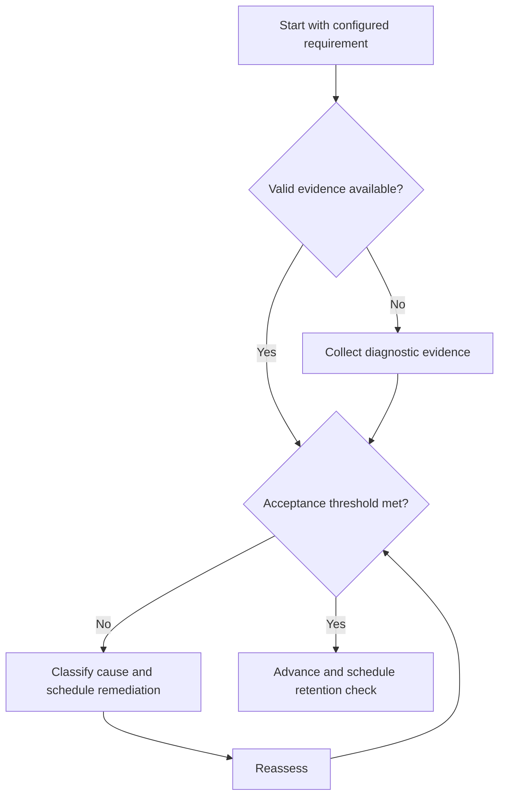

# Syllabus Map

## Purpose

Represent the official examination syllabus as a verified external configuration.

## Scope

No subject, mark, pattern, date, or distribution is embedded in this document.

## Theory

A versioned requirements map makes change visible and connects each official item to prerequisites, evidence, and review status.

## Scientific Basis

Evidence is distinguished from implementation judgment:

- **Evidence:** registered research supporting retrieval, distributed practice,
  feedback-directed practice, or active learning where cited.
- **Best practice:** a conservative engineering translation of evidence into a
  repeatable protocol; effectiveness must be checked locally.
- **Opinion:** an operator preference with no evidentiary claim; record it as a
  configurable choice.

Primary registered sources for this system include `SRC-DUNLOSKY-2013`, `SRC-ROEDIGER-KARPICKE-2006`, `SRC-CEPEDA-2006`, `SRC-ERICSSON-1993`, and `SRC-FREEMAN-2014`.

## Framework

| Element | Operational rule |
|---|---|
| Cycle ID | Operator-defined examination cycle |
| Official source | Authoritative URL or document identifier |
| Verification | Access date and independent check |
| Requirement ID | Stable local mapping to exact source location |
| Concept links | Canonical knowledge nodes |
| Status | Unmapped, mapped, diagnosed, active, verified, retired |

## Workflow

Acquire official source; verify authority; archive metadata; parse without interpretation; assign IDs; map concepts and dependencies; review completeness.

## Implementation

Keep source text or permitted extract separate from the concept system. Record changes as additions, removals, or modifications.

## Decision Trees

If authority or version is uncertain, mark configuration blocked and do not derive coverage claims.

## Failure Modes

Using coaching material as official authority, overwriting old versions, and mapping by ambiguous topic name.

## Recovery

Obtain the authoritative source, compare versions, correct mappings, and invalidate only affected coverage decisions.

## Examples

A requirement points to an official source location and links to several reusable concept nodes without duplicating their notes.

## Tables

The framework table is normative. Personal observations and examination-cycle
values remain in private or cycle-specific configuration.

## Mermaid Diagrams

The decision tree defines the evidence-to-action loop for this document.

## Cross References

- [Curriculum Integration](../04-study-system/curriculum-integration.md)
- [Subject Sequencing](subject-sequencing.md)
- [Adaptive Planning](score-analysis.md)

## References

- [Source register](../../references/source-register.yml)
- `SRC-DUNLOSKY-2013`, `SRC-ROEDIGER-KARPICKE-2006`, `SRC-CEPEDA-2006`, `SRC-ERICSSON-1993`, and `SRC-FREEMAN-2014`

## Next Steps

Run diagnostics against the verified requirement map.

## Acceptance Criteria

- [x] Evidence, best practice, and opinion are distinguishable.
- [x] Decisions require evidence and include recovery.
