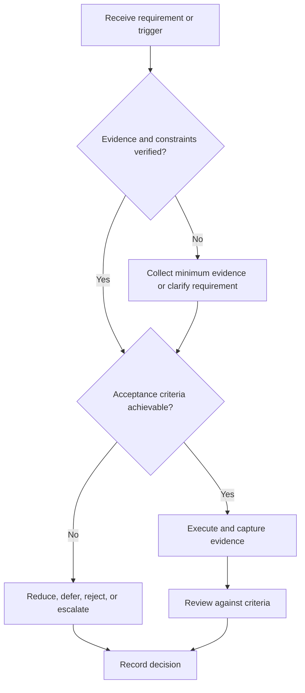

# Placement System

## Purpose

Provide canonical navigation for reusable placement readiness and interview evidence.

## Scope

The system supports role research, applications, interviews, and offer decisions without optimizing for one employer.

## Theory

Placement is an evidence and interface system: role requirements are mapped to verified capability, applications are controlled work items, and interviews are reviewed as samples rather than guarantees.

## Framework

| Element | Operational rule |
|---|---|
| Role definition | Versioned requirements and constraints |
| Evidence | Resume, portfolio, assessments, examples |
| Pipeline | Application state and next action |
| Feedback | Interview and application reviews |
| Decision | Continue, improve, pause, withdraw, or evaluate offer |

## Workflow

Define role families; map competencies; build truthful evidence; manage applications; prepare and simulate interviews; review results; evaluate offers.

## Implementation

Keep mutable employer inputs in private application records. Store reusable methods in this system.

## Decision Tree

Do not apply when mandatory claims lack evidence or the role violates hard constraints; otherwise use a bounded readiness gap plan.

## Failure Modes

Mass applications without targeting, inflated claims, generic preparation, and interpreting rejection as a capability diagnosis.

## Recovery

Validate role assumptions, correct evidence, narrow the pipeline, and run focused practice before resuming.

## Examples

One tested embedded project may support a resume bullet, portfolio entry, and interview example through links to the same evidence.

## Tables

The framework table is normative. Company-specific, role-specific, or
project-specific values belong in versioned configuration and records.

## Mermaid Diagrams

The decision tree defines the control path for this document.

## Cross References

- [Role Targeting](role-targeting.md)
- [Aptitude Plan](aptitude-plan.md)
- [Offer Evaluation](offer-evaluation.md)
- [Project System](../07-project-system/README.md)
- [Study System](../04-study-system/README.md)

## References

- [Source register](../../references/source-register.yml)
- `SRC-NASA-SE-2016`, `SRC-ISO-29148-2018`, `SRC-CAMPION-1997`, and `SRC-GITHUB-FLOW`

## Next Steps

Define target role families.

## Acceptance Criteria

- [x] Inputs, evidence, decisions, and recovery are explicit.
- [x] No company, salary, interview question, or hiring statistic is hardcoded.
