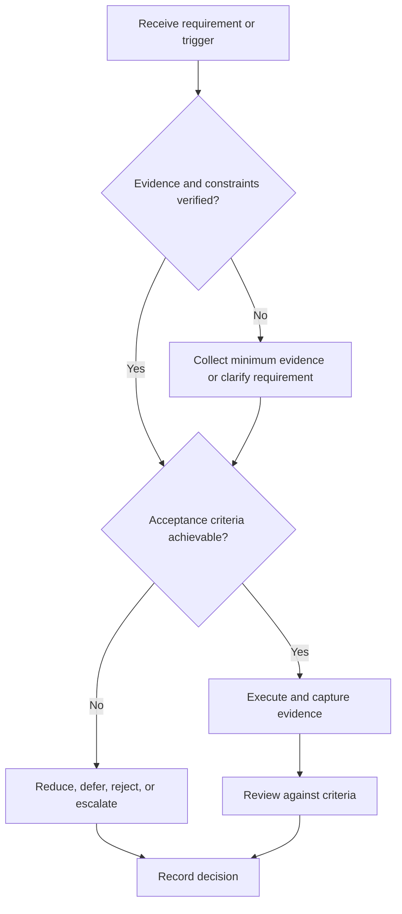

# Placement System

## Purpose

Provide canonical navigation for reusable placement readiness and interview evidence.

## Scope

The system supports role research, applications, interviews, and offer decisions without optimizing for one employer.

## Theory

Placement is an evidence and interface system: role requirements are mapped to verified capability, applications are controlled work items, and interviews are reviewed as samples rather than guarantees.

## Framework

| Element | Operational rule |
|---|---|
| Role definition | Versioned requirements and constraints |
| Evidence | Resume, portfolio, assessments, examples |
| Pipeline | Application state and next action |
| Feedback | Interview and application reviews |
| Decision | Continue, improve, pause, withdraw, or evaluate offer |

## Workflow

Define role families; map competencies; build truthful evidence; manage applications; prepare and simulate interviews; review results; evaluate offers.

## Implementation

Keep mutable employer inputs in private application records. Store reusable methods in this system.

## Decision Tree

Do not apply when mandatory claims lack evidence or the role violates hard constraints; otherwise use a bounded readiness gap plan.

## Failure Modes

Mass applications without targeting, inflated claims, generic preparation, and interpreting rejection as a capability diagnosis.

## Recovery

Validate role assumptions, correct evidence, narrow the pipeline, and run focused practice before resuming.

## Examples

One tested embedded project may support a resume bullet, portfolio entry, and interview example through links to the same evidence.

## Tables

The framework table is normative. Company-specific, role-specific, or
project-specific values belong in versioned configuration and records.

## Mermaid Diagrams

The decision tree defines the control path for this document.

## Cross References

- [Role Targeting](role-targeting.md)
- [Aptitude Plan](aptitude-plan.md)
- [Offer Evaluation](offer-evaluation.md)
- [Project System](../07-project-system/README.md)
- [Study System](../04-study-system/README.md)

## References

- [Source register](../../references/source-register.yml)
- `SRC-NASA-SE-2016`, `SRC-ISO-29148-2018`, `SRC-CAMPION-1997`, and `SRC-GITHUB-FLOW`

## Next Steps

Define target role families.

## Acceptance Criteria

- [x] Inputs, evidence, decisions, and recovery are explicit.
- [x] No company, salary, interview question, or hiring statistic is hardcoded.

---

## Placement Strategy (Operational — Rounak)

### Primary Target

**Role:** RTL Design Engineer / FPGA Engineer / ASIC Design Engineer

| Tier | Package | Target Companies |
|---|---|---|
| **Tier 1** | 45+ LPA | Intel, AMD, NVIDIA, Qualcomm, Broadcom, Texas Instruments, Analog Devices |
| **Tier 2** | 25–40 LPA | Samsung Semiconductor, Synopsys, Cadence, Micron, NXP |
| **Tier 3** | 15–25 LPA | Indian semiconductor startups (Steradian, Saankhya, Signalchip, Vayavya) |
| **Remote** | Varies | Google, Microsoft, Amazon (hardware), remote-first FPGA companies |

### Strategic Decision: Dual-Track

You cannot master both ECE hardware and CSE/quant to the same depth in 184 days. **Choose primary, add fallback.**

| Lane | Primary Target | Best Fit |
|---|---|---|
| **Hardware (RTL/FPGA/Verification)** | Intel, AMD, NVIDIA, Qualcomm, Broadcom, Synopsys, Cadence | ECE background, GATE syllabus aligns directly |
| **Quant/Software** | HFT firms (Tower Research, Graviton), FAANG, Microsoft | High DSA + problem-solving |

**Recommendation: Primary = Hardware (RTL/FPGA). Secondary = Quant/Software (DSA + System Design).**

GATE prep covers 70% of hardware interview topics. Adding DSA and system design gives flexibility.

### The Application Funnel

| Month | Focus | Target |
|---|---|---|
| **August** | Tier 3 + Tier 2, internships + graduate roles | 50+ applications |
| **September** | Tier 2 + Tier 1, start networking with recruiters | 10+ mock interviews |
| **October** | All remaining target companies, interview preparation | Secure interview calls |
| **November** | Complete 15+ interviews, convert 3 to final rounds | Offers in hand |
| **December** | Negotiate offers, target 45+ LPA, have fallbacks | Final negotiation |
| **January** | Secure final role | Start Phase 2 |

### Interview Preparation Timeline

| Phase | GATE/ECE Focus | Placement Skill Added | Deliverable |
|---|---|---|---|
| Week 1–2 (Aug) | Networks, Signals, LA | Python basics, LeetCode Easy | LeetCode account, 5 problems |
| Week 3–4 (Aug) | Devices, Analog, Digital | Data Structures | 20 LeetCode, HDLBits started |
| Week 5–6 (Sep) | Control, Communications | Verilog refresher, FPGA | UART module in Verilog |
| Week 7–8 (Sep) | EMFT, Sensors | DSA: Trees, Graphs | 50 LeetCode, 30 HDLBits |
| Week 9–12 (Oct) | Revision | DP, Greedy, Backtracking | 100 LeetCode, RVS complete |
| Week 13–16 (Nov) | Mock tests | CA, OS, Interview STAR stories | 150 LeetCode, 6 mock interviews |

### AI Automation Agency Income

| Service | Price Range |
|---|---|
| Chatbot Development | ₹15,000–30,000 |
| Workflow Automation | ₹10,000–20,000 |
| Data Processing | ₹20,000–50,000 |
| AI Content Generation | ₹5,000–15,000 |
| AI Consulting | ₹20,000–50,000 |

**August Income Target:** ₹5,000 first gig
**6-Month Income Target:** ₹6,00,000 total
**Long-term Monthly:** ₹2,00,000/month

### Remote International Strategy

**Timeline:** June 2027 (post-graduation)

| Country | Target Companies |
|---|---|
| Taiwan | TSMC, MediaTek, Realtek |
| Korea | Samsung, SK Hynix |
| Singapore | Broadcom, Marvell, Qualcomm |
| USA | Remote-first hardware companies |

### Fallback Options

| Scenario | Response |
|---|---|
| 45+ LPA not achieved | 25+ LPA + continue interviewing |
| Job not secured | Full-time internship/freelance, or GATE for next year |
| No placement offers | Start AI automation agency full-time |
| All options failed | Study abroad (DAAD, MITACS, PhD) |

### Cross References (Updated)

- [Placement Targets](../01-charter/TARGETS.md) — Goals 1–6 (Career & Financial)
- [August Battle Plan](../03-execution-system/AUGUST-BATTLE-PLAN.md) — August income and application targets
- [AI/ML System](../../14-computer-science-and-fullstack/05-ai-engineering-and-agentic-systems/README.md) — AI agency technical foundation
- [Project System](../07-project-system/README.md) — RVS Accelerator + QSIF portfolio
- [Resource Directory](../../references/RESOURCE-DIRECTORY.md) — DSA, System Design resources

