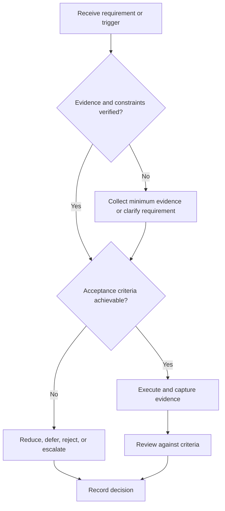

# Application Pipeline

## Purpose

Control applications as traceable work items with explicit next actions.

## Scope

No employer, recruitment date, selection ratio, or application-volume target is embedded.

## Theory

Pipeline control prevents duplicate work and exposes bottlenecks while keeping external hiring outcomes separate from controllable actions.

## Framework

| Element | Operational rule |
|---|---|
| Opportunity ID | Private stable record |
| Source/freshness | Current posting or verified contact |
| Fit | Requirement evidence and hard constraints |
| State | Research, prepare, submitted, interview, closed |
| Next action | Owner and due date |
| Outcome | Observed external event, not a capability verdict |

## Workflow

Capture; verify authenticity; screen constraints; map fit; tailor evidence; quality check; submit; record state; follow up appropriately; close and review.

## Implementation

Store personal contacts and application details privately. Aggregate only non-sensitive trends.

## Decision Tree

Do not submit when eligibility is unknown, material claims are unsupported, or the opportunity appears fraudulent.

## Failure Modes

Duplicate submissions, stale postings, generic resumes, missing follow-up records, and treating silence as a personal judgment.

## Recovery

Clean states, validate sources, close stale items, repair the dominant readiness defect, and restart with a smaller batch.

## Examples

A closed application yields a record of preparation quality and response timing without implying why selection changed.

## Tables

The framework table is normative. Company-specific, role-specific, or
project-specific values belong in versioned configuration and records.

## Mermaid Diagrams

The decision tree defines the control path for this document.

## Cross References

- [Role Targeting](role-targeting.md)
- [Resume System](resume-system.md)
- [Interview Retrospective](mock-interviews.md)

## References

- [Source register](../../references/source-register.yml)
- `SRC-NASA-SE-2016`, `SRC-ISO-29148-2018`, `SRC-CAMPION-1997`, and `SRC-GITHUB-FLOW`

## Next Steps

Route any interview invitation into the appropriate preparation plan.

## Acceptance Criteria

- [x] Inputs, evidence, decisions, and recovery are explicit.
- [x] No company, salary, interview question, or hiring statistic is hardcoded.
