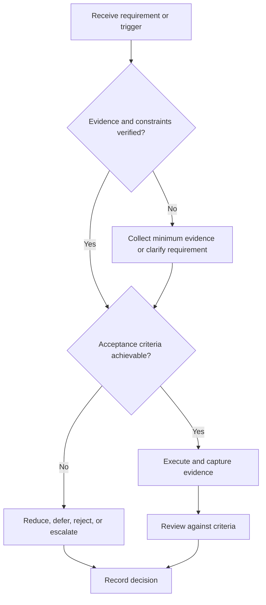

# Aptitude Preparation Framework

## Purpose

Prepare for configurable reasoning and aptitude requirements using diagnostics and error control.

## Scope

The framework does not assume that a role uses aptitude screening or prescribe question categories.

## Theory

Preparation should begin from verified role requirements and representative diagnostics, then use the Study System for targeted remediation.

## Framework

| Element | Operational rule |
|---|---|
| Requirement source | Current role or process evidence |
| Diagnostic | Representative tasks under recorded conditions |
| Error type | Knowledge, representation, method, execution, time |
| Practice | Targeted then mixed |
| Retention | Delayed reassessment |
| Stop rule | Requirement removed or threshold met |

## Workflow

Verify requirement; diagnose; classify; remediate; practice mixed items; time only after accuracy; reassess; update readiness evidence.

## Implementation

Keep content pools external and licensed. Store only metadata, attempts, and decisions here.

## Decision Tree

If screening is unverified, do not divert significant capacity; run only a bounded probe.

## Failure Modes

Practicing generic banks indefinitely, memorizing item patterns, and timing before method stability.

## Recovery

Return to the failed reasoning step, reduce set size, restore feedback, and reassess with unseen items.

## Examples

A numerical reasoning gap maps to its underlying concept rather than being treated as a permanent trait.

## Tables

The framework table is normative. Company-specific, role-specific, or
project-specific values belong in versioned configuration and records.

## Mermaid Diagrams

The decision tree defines the control path for this document.

## Cross References

- [Assessment Protocol](../04-study-system/assessment-protocol.md)
- [Error Log](../04-study-system/error-log-protocol.md)
- [Coding Plan](coding-plan.md)

## References

- [Source register](../../references/source-register.yml)
- `SRC-NASA-SE-2016`, `SRC-ISO-29148-2018`, `SRC-CAMPION-1997`, and `SRC-GITHUB-FLOW`

## Next Steps

Prepare the next verified interview requirement.

## Acceptance Criteria

- [x] Inputs, evidence, decisions, and recovery are explicit.
- [x] No company, salary, interview question, or hiring statistic is hardcoded.
